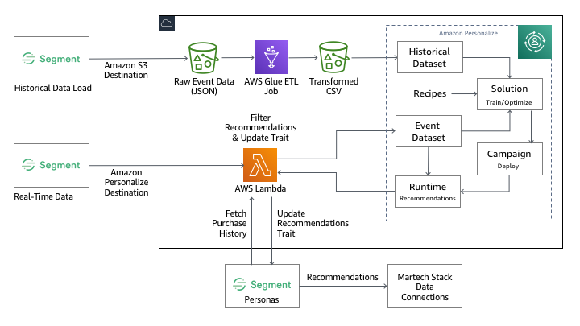

# Segment + Amazon Personalize Workshop

[Segment](http://segment.com) provides an easy way to collect data once about what users are doing and send the data to third party tools and warehouses. Segment does this by enabling businesses to collect first-party event data from their websites, mobile apps, and cloud tools like email and CRM, combine with offline data, then standardize and clean the data so it can be utilized in 200+ tools like marketing, analytics, attribution, and warehouses including Amazon Redshift.

[Amazon Personalize](https://aws.amazon.com/personalize/) is a machine learning service that makes it easy for developers to create individualized recommendations for customers using their applications.

Machine learning is being increasingly used to improve customer engagement by powering personalized product and content recommendations, tailored search results, and targeted marketing promotions. However, developing the machine-learning capabilities necessary to produce these sophisticated recommendation systems has been beyond the reach of most organizations today due to the complexity of developing machine learning functionality. Amazon Personalize allows developers with no prior machine learning experience to easily build sophisticated personalization capabilities into their applications, using machine learning technology perfected from years of use on Amazon.com.



This project includes the content, instructions, test data, and code for a workshop that is intended to guide attendees through the process of integrating Segment with Amazon Personalize. The workshop will teach attendees how to use Segment to collect and send data to Amazon Personalize, where it can be used to make real-time item recommendations, tailored search results, and targeted marketing promotions. The workshop will include hands-on exercises for data collection and analytics, training machine learning models, and activating insights for personalized recommendations in a sample application.

Attendees will leave with the skillsets for how to unlock real-time personalization and recommendations using the same technology used at Amazon.com.

## Workshop Setup

Before following the exercises below, be sure to clone this repository to your local system.

```bash
git clone https://github.com/james-jory/segment-personalize-workshop.git
```

If you are following this workshop on your own (i.e. in your own personal AWS account and **not** part of an organized workshop delivered by AWS), you will also need to apply the CloudFormation template [eventengine/workshop.template](eventengine/workshop.template) within your account before stepping through the exercises. This template will setup the necessary resources and IAM roles & policies required by the exercises in this workshop. If you're participating in an AWS-led workshop, this has likely already been done for you.

## [Exercise 1](exercise1/) - Data Preparation, Filtering, and Exploration

The focus of this [exercise](exercise1/) is to learn how to use historical clickstream data from Segment to train or bootstrap a machine learning model in Personalize. We will walk through the process of configuring Segment to write clickstream data to an Amazon Simple Storage Service (S3) bucket. Then you will build an AWS Glue Job that will transform and filter the raw data written to S3 into a format that can be uploaded into Personalize. In addition, we will learn how to use Amazon Athena to query and explore this data directly from S3.

## [Exercise 2](exercise2/) - Create Personalize Dataset Group, Solution, and Campaign

In this [exercise](exercise2/) we will pick up where we left off in the prior exercise by uploading the transformed data from S3 into a Personalize Dataset Group. Then you will create a Personalize Solution based on this data. A solution is the term Amazon Personalize uses for a trained machine learning model. Creating a solution entails optimizing the model to deliver the best results for a specific business need. Amazon Personalize uses "recipes" to create these personalized solutions. We will wrap up this exercise by creating a campaign. A deployed solution is known as a campaign, and is able to make recommendations for your users.

## [Exercise 3](exercise3/) - Getting Recommendations from Personalize

In this [exercise](exercise3/) we will demonstrate how recommendations from Personalize can be accessed by your applications via a REST API using [Amazon API Gateway](https://aws.amazon.com/api-gateway/) and [AWS Lambda](https://aws.amazon.com/lambda/). You can use this function as a secure mechanism to access recommendations from your web and mobile apps as well as an interception point to rehydrate item identifiers into more metadata rich representations.

## [Exercise 4](exercise4/) - Real-Time Data Collection and Activating Recommendations using Segment Personas

In this final [exercise](exercise4/) we will look at how [Segment's Amazon Personalize](https://segment.com/docs/destinations/amazon-personalize/) destination can be used to send events collected in real-time directly to Personalize. This will allow Personalize to learn from customer interactions that are being collected by Segment to improve its recommendations. Furthermore, we will learn now to take recommendations from Personalize and attach those recommendations to customer profiles in Segment Personas. This allows you to weave recommendations not only in your own website and mobile apps but also throughout your martech stack.