# Exercise 1 - Data Transformation, Filtering, and Exploration

## Overview

The effectiveness of machine learning models is directly tied to the quantity and quality of data input during the training process. For most personalization ML solutions, training data typically comes from clickstream data collected from websites, mobile applications, and other online & offline channels where end-users are interacting with items for which we wish to make recommendations. Examples of clickstream events include viewing items, adding items to a list or cart, and purchasing items. Although an Amazon Personalize Campaign can be started with just new clickstream data, the initial quality of the recommendations will not be as high as a model that has been trained on recent historical data.

One of Segment's core capabilities is the ability collect semantic events and properties and to aggregate those properties into user profiles using Personas for later use in marketing and analytics tools.

In this exercise we will walk through the process required to take historical clickstream data collected by Segment to train a model in Amazon Personalize. The advantage of bootstrapping Personalize with historical clickstream data is that you will start with a model that reflects your users's latest purchases and browsing behavior.

Segment provides the ability to send event data from one or more data sources configured in your Segment account to several AWS services including S3, Kinesis, and Redshift. Since the raw format, fields, and event types in the Segment event data cannot be directly uploaded to Amazon Personalize for model training, this exercise will guide you through the process of transforming the data into the format expected by Personalize.

In the interest of time for the workshop, we will start with data that has already been written to an Amazon S3 bucket by the Segment S3 destination. The [format](https://segment.com/docs/destinations/amazon-s3/#data-format) of these files is compressed JSON where events are grouped into directories by Segment source ID and time. Since the Personalize service requires training data to be uploaded in CSV format, we will need to aggregate, filter, and transform the raw JSON into a single CSV file using an ETL job. We will use AWS Glue for this step. However, before creating our Glue ETL job, we'll learn how to use Amazon Athena to easily explore our training data. Being able to quickly inspect and investigate training data can be invaluable in gaining insight from and resolving issues.

> There is a minimum amount of data that is necessary to train a model. Using existing historical data allows you to immediately start training a solution. If you ingest data as it is created, and there is no historical data, it can take a while before training can begin.

### What You'll Be Building

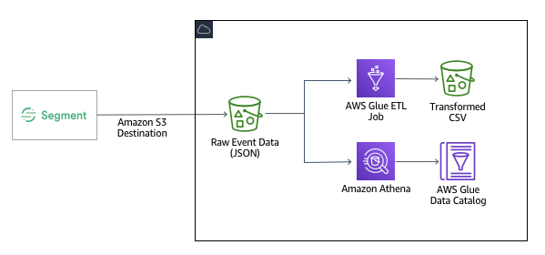

In this exercise we will walk through the process required to take the raw historical clickstream data collected by Segment to train a model in Amazon Personalize. The advantage of bootstrapping Personalize with historical clickstream data is that you will start with a model that has the benefit of past events to make more accurate recommendations. Segment provides the ability to push clickstream data to the following locations in your AWS account.

* S3 bucket
* Kinesis Data Stream
* Kinesis Data Firehose
* Redshift

For this exercise we will walk you through how to setup an S3 destination in your Segment account. In the interest of time, though, we will provide a pre-made test dataset that you will upload to S3 yourself. Then you will use AWS Glue to create an ETL (extract, transform, load) Job that will filter and transform the raw JSON file into the format required by Personalize. The output file will be written back to S3. Finally, you will learn how to use Amazon Athena to query and visualize the data in the transformed file directly from S3.

> The Segment Amazon S3 destination is just one method for collecting historical training data for Personalize. If you're already using [Segment's Amazon Redshift Data Warehouse destination](https://segment.com/docs/destinations/redshift/), you can easily extract (or unload) data from your Redshift instance as a CSV suitable for uploading into Personalize. See the [sql/redshift_unload_as_csv.sql](sql/redshift_unload_as_csv.sql) file.

### Exercise Preparation

If you haven't already cloned this repository to your local machine, do so now.

```bash
git clone https://github.com/james-jory/segment-personalize-workshop.git
```

Claim your Segment Workspace and Event Engine code:

[Segment Workspaces](https://docs.google.com/spreadsheets/d/1SyEDxLmquN96tsv-dhrOhduRLilWjITQyCBXCcA73U4/edit?usp=sharing)

## Part 1 - Set up Your Segment Workspace

Go to https://app.segment.com and log in as:


    username: igor+awsmlworkshop@segment.com
    password: <will be on the whiteboard>

Select your workspace. For this workshop, you will need to have a Segment Business Tier workspace that has Personas provisioned.  

If you are reading this document after the workshop, please contact your Segment sales representative to get set up with a demo workspace with Personas and Business Tier.

## Part 2 - Create Segment Sources

Segment Sources allow you to collect semantic events as your users interact with your web sites, mobile applications, or server-side applications.  For this workshop, you will set up sources for a web application, an Android application, and iOS mobile application.  We will also create a source that will be used to send recommendations from Personalize to user profiles in Segment.

Your initial Segment workspace will look like this:


You will need to add four sources, using the ‘Add Source’ button in the screen shot above.  To set up a source:


Once your source is configured, it will appear in your workspace like this:


You will need to repeat these steps to configure three more sources.  One for Android, one for iOS, and one for your Personalize events.  

Name your sources as follows:

```
website-prod
android-prod
ios-prod
personas-events-source
```

For the web source, use the Javascript source type, for Android the Android source, for iOS the iOS source, and for the personas-events-source use the Python source type.

## Part 3 - Set up Segment Personas

Personas will use the events that your collect from your user interactions to create individual user profiles.  This will allow you and your marketing teams to group users into audiences.  Later, you will be able to define the destinations to which you will be able to send user definitions and traits by setting up destinations in Personas.  You will also be able to add product recommendations from Personalize to each user profile in Personas.

After setting up your sources, your workspace should look something like this:


Click on the Personas Orb on the left hand side of your screen, and you will be redirected to the Personas setup wizard.  This will allow you to set up Personas so that it can receive events from the sources which you just configured.


Click ‘Get Started’ and enable all of the sources you just created:


Then click ‘Review’:


And then ‘Enable Personas.’

You now have an event channel from your applications, and a way to collect identity information about individual users.  Let’s set up Segment so that this data can be passed on to Personalize via an S3 bucket for your initial training set.


## Part 4 - Create S3 Destination in Segment

Although we won't be testing pushing data from Segment to S3 in the workshop due to time limitations, we will walk through how to configure an S3 destination in Segment. Start by logging in to your Segment account and clicking "Destinations" in the left navigation. Then click the "Add Destination" button.


On the Destination catalog page, search for "S3" in the search field. Click on "Amazon S3" in the search results.

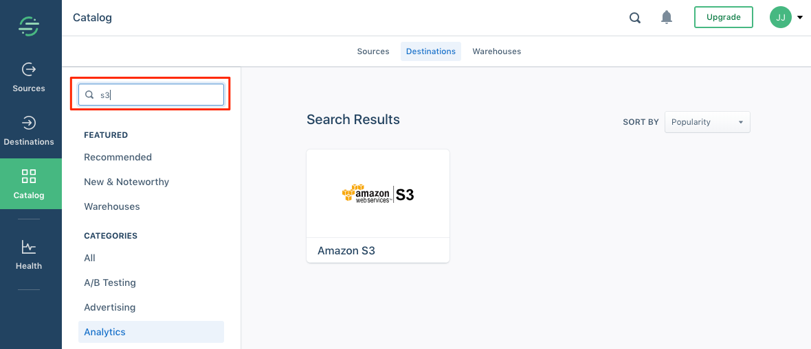

Click "Configure Amazon S3" to setup the S3 destination.

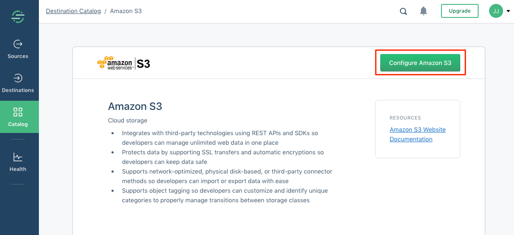

On the "Select Source" page, select an existing Source and click the "Confirm Source" button. To learn more about setting up Sources in Segment, see the Segment [documentation](https://segment.com/docs/sources/).

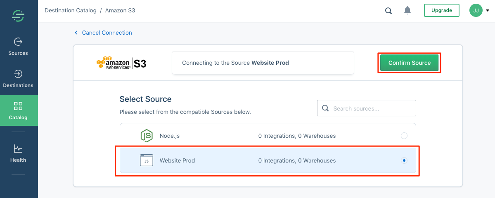

The Settings page for the S3 Destination requires an S3 bucket name. An S3 bucket has already been created for you in your AWS account for the workshop. To find the bucket name, login to your AWS workshop account and browse to the S3 service page in a different browser tab/window. Locate the bucket with a name starting with `personalize-data-...`. Click on the bucket name and copy the name to your clipboard.

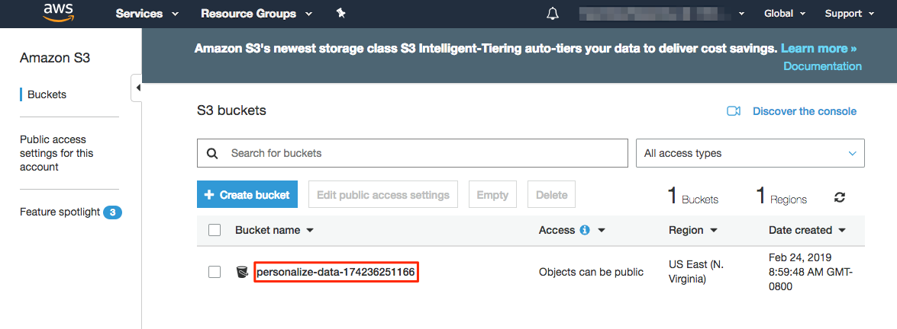

Back on the Segment Amazon S3 destination settings page, paste the bucket name into the "Bucket Name" field. Also be sure to activate the destination at the top of the configuration form.

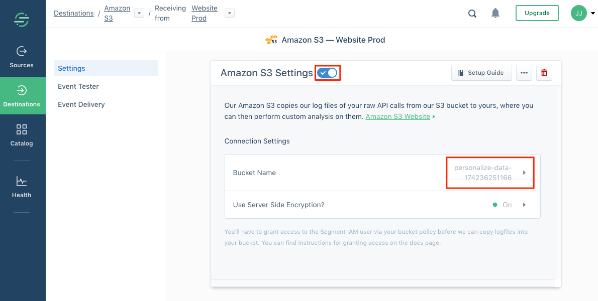

Detailed instructions for configuring an S3 destination can be found on Segment's [documentation site](https://segment.com/docs/destinations/amazon-s3/).

As mentioned above, we won't be testing actually pushing data through the S3 destination in this workshop due to time limitations. Instead, we will upload a dataset in the next part.

## Part 5 - Send Test Data Into Your Segment Workspace

This step will pre-populate simulated event data into your Segment instance, your S3 bucket, and Personas.  This will be needed in later steps when configuring Personalize to send recommendations to Personas and your marketing tools.

Because events are synchronized from Segment to S3 on a batch basis, we will also give you a pre-populated initial training set to save time, in the next step.  You will need some data to be populated in Segment however, since this will allow you to create recommendations based on (simulated) user activity.

Open the segment-event-generator.py file in the ./data folder of the workshop project.


Then in your Segment workspace, get the write keys for the web, android, and ios sources you created earlier.  You can get these by clicking on each source.


The write key for the source is in the next screen:


Add each write key to the appropriate variable entry in the script (you will not need a key for the email_write_key):


***TODO: UPDATE WITH RUNNING SCRIPT IN CLOUD9***

In your terminal, run the script:

```
python3 segment-event-generator.py 2019-02-26
```

This will generate two days worth of interaction data in your Segment instance.  You can see your events by clicking on each of your sources and looking at the Debugger view:


This view shows the last 50 real time events for that source.  If you have events in all of your sources, you are ready to go to the next step.

## Part 6 - Explore Workshop Test Data

In the interest of time, we have pre-populated an S3 bucket with raw historical JSON data from a sample Segment account. We will use this data to train an initial model in Personalize that will be used throughout the remainder of this workshop.

In this step we will demonstrate how Amazon Athena can be used to create external table pointing at the raw JSON files and then query those files using SQL. This can be an invaluable tool to inspect your data before uploading it into Personalize and as you iterate with models over time.

Log in to the AWS console. If you are participating in an AWS led workshop, use the instructions provided to access your temporary workshop account. Browse to the Amazon Athena service page in the console, making sure that you are in the "N. Virginia" region.

Before we can create a table for the data in S3, we need an Athena database. For the purposes of this exercise, the database that we use is not important. If a "default" database has not been setup for you, create one by entering the following DDL statement in the "New query 1" tab and pressing the "Run query" button.

```sql
CREATE DATABASE IF NOT EXISTS default;
```

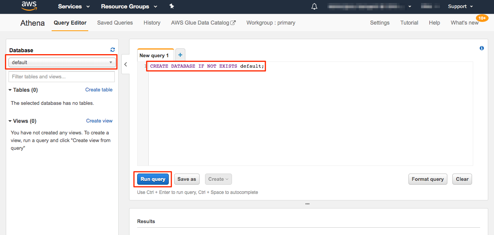

Next let's create a table in Athena that points to the historical data in S3. We have written the DDL statement for you. Open the [sql/athena_create_table.sql](sql/athena_create_table.sql) file, copy the contents to your clipboard, and paste file contents into the "New query 1" tab in the Athena console. Take a moment to inspect the "CREATE EXTERNAL TABLE..." statement. One important aspect of this DDL statement is that there are several field name mapping statements in the SERDEPROPERTIES section. These mappings address the [Athena requirement](https://docs.aws.amazon.com/athena/latest/ug/tables-databases-columns-names.html) that the only special character allowed is an underscore. Since the Segment test data has several trait names with embedded spaces, these mappings allow us to safely query this data. 

When you're ready, press the "Run query" button to execute the statement. This will create the table in the Glue Data Catalog. Now you are ready to execute queries against the compressed JSON files. Trying inspecting the data with a few queries.

```sql
-- What does the data look like?
SELECT * FROM segment_logs limit 20;
-- The 'event' column is what we can use for event type in training our model.
-- What event types are available?
SELECT COUNT(messageId) AS eventCount, event FROM segment_logs GROUP BY event ORDER BY eventCount DESC;
-- In order to make recommendations we need an item/product to recommend.
-- Our product SKU is in 'properties.sku'. What event types are available where we have a SKU?
SELECT COUNT(messageId) AS eventCount, event FROM segment_logs WHERE properties.sku IS NOT NULL GROUP BY event ORDER BY eventCount DESC;
```

From the results of the last query you will notice that there are three events that include a product SKU: 'Product Clicked', 'Product Added', and 'Order Completed'. We will use these events in training our model for product recommendations. We could also train models based on other event types, such as 'Page Viewed' or 'Signup Success' and use them to make content or membership program recommendations.

## Part 7 - Data Preparation

Since the raw format, fields, and event types in the Segment event data cannot be directly uploaded to Amazon Personalize for model training, this step will guide you through the process of transforming the data into the format expected by Personalize. We will use the same compressed JSON files you queried with Athena in the previous step. We will use AWS Glue to create an ETL job that will take the JSON files, apply filtering and field mapping to each JSON event, and write the output back to S3 as a CSV file.

### Create AWS Glue ETL Job

First, ensure that you are logged in to the AWS account provided to you for this workshop. Then browse to the Glue service in the console, making sure that the AWS region is "N. Virginia" (us-east-1). Click the "Get started" button and then click "Jobs" in the left navigation on the Glue console page.

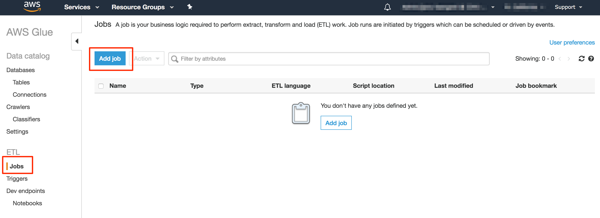

Click the "Add job" button and enter the following information.

* Enter a job name such as "SegmentEventsJsonToCsv".
* For IAM role, a role has already been created for you that starts with the name "module-personalize-GlueServiceRole-...". Select this role.
* Leave Type as "Spark".
* For "This job runs", click the radio button "A new script to be authored by you".
* Leave everything else the same and click Next at the bottom of the form.
* On the "Connections" step just click "Save job and edit script" since we are not accessing data in a database for this job.

The source code for the Glue job has already been written for you. Copy the contents of [etl/glue_etl.py](etl/glue_etl.py) to your clipboard and paste it into the Glue editor window. Click "Save" to save the job script.

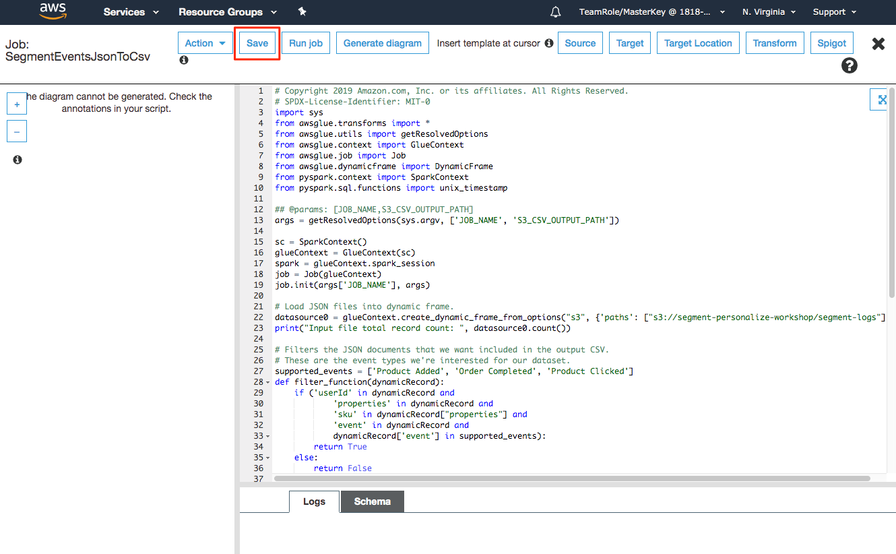

Let's review key parts of the script in more detail. First, the script is initialized with a few job parameters. We'll see how to specify these parameter values when we run the job below. For now, just see we're passing in the location where the output CSV should be written through `S3_CSV_OUTPUT_PATH`. The `JOB_NAME` parameter is passed to our job by the Glue execution framework.

```python
args = getResolvedOptions(sys.argv, ['JOB_NAME', 'S3_CSV_OUTPUT_PATH'])
```

Next the Spark and Glue contexts are created and associated. A Glue Job is also created and initialized.

```python
sc = SparkContext()
glueContext = GlueContext(sc)
spark = glueContext.spark_session
job = Job(glueContext)
job.init(args['JOB_NAME'], args)
```

The first step in our Job is to load the raw JSON file as a Glue DynamicFrame. We're loading the JSON from the shared S3 bucket (segment-personalize-data) where the training data for the workshop has already been staged. Note that we're specifying the `recurse:True` parameter so that Glue will recursively load all files under the `segment-logs` folder.

```python
datasource0 = glueContext.create_dynamic_frame_from_options("s3", {'paths': ["s3://segment-personalize-data/segment-logs"], 'recurse':True}, format="json")
```

Since we only want specific events for training our Personalize model, we'll use Glue's `Filter` transformation to keep only the records we want. The `datasource0` DynamicFrame created above is passed to `Filter.apply(...)` function along with the `filter_function` function. It's in `filter_function` where we keep events that have a product SKU and `userId` specified. The resulting DynamicFrame is captured as `interactions`.

```python
supported_events = ['Product Added', 'Order Completed', 'Product Clicked']
def filter_function(dynamicRecord):
    if ('userId' in dynamicRecord and
            'properties' in dynamicRecord and
            'sku' in dynamicRecord["properties"] and
            'event' in dynamicRecord and
            dynamicRecord['event'] in supported_events):
        return True
    else:
        return False

interactions = Filter.apply(frame = datasource0, f = filter_function, transformation_ctx = "interactions")
```

Next we will call Glue's `ApplyMapping` transformation, passing the `interactions` DynamicFrame from above and field mapping specification that indicates the fields we want to retain and their new names. These mapped field names will become the column names in our output CSV. You'll notice that we're using the product SKU as the `ITEM_ID` and `event` as the `EVENT_TYPE`. We're also renaming the `timestamp` field to `TIMESTAMP_ISO` since the format of this field value in the JSON file is an ISO 8601 date and Personalize requires timestamps to be specified in UNIX time (number seconds since Epoc).

```python
applymapping1 = ApplyMapping.apply(frame = interactions, mappings = [ \
    ("userId", "string", "USER_ID", "string"), \
    ("properties.sku", "string", "ITEM_ID", "string"), \
    ("event", "string", "EVENT_TYPE", "string"), \
    ("timestamp", "string", "TIMESTAMP_ISO", "string")], \
    transformation_ctx = "applymapping1")
```

To convert the ISO 8601 date format to UNIX time for each record, we'll use Spark's `withColumn(...)` to create a new column called `TIMESTAMP` that is the converted value of the `TIMESTAMP_ISO` field. Before we can call `withColumn`, though, we need to convert the Glue DynamicFrame into a Spark DataFrame. That is accomplished by calling `toDF()` on the output of ApplyMapping transformation above. Since Personalize requires our uploaded CSV to be a single file, we'll call `repartition(1)` on the DataFrame to force all data to be written in a single partition. Finally, after creating the `TIMESTAMP` in the expected format, `DyanmicFrame.fromDF()` is called to convert the DataFrame back into a DyanmicFrame and then we'll drop the `TIMESTAMP_ISO` field.

```python
# Repartition to a single file since that is what is required by Personalize
onepartitionDF = applymapping1.toDF().repartition(1)
# Coalesce timestamp into unix timestamp
onepartitionDF = onepartitionDF.withColumn("TIMESTAMP", \
	unix_timestamp(onepartitionDF['TIMESTAMP_ISO'], "yyyy-MM-dd'T'HH:mm:ss.SSS'Z'"))
# Convert back to dynamic frame
onepartition = DynamicFrame.fromDF(onepartitionDF, glueContext, "onepartition_df")
# Drop the ISO formatted timestamp
onepartition = onepartition.drop_fields(['TIMESTAMP_ISO'])
```

The last step is to write our CSV back to S3 at the path specified by the `S3_CSV_OUTPUT_PATH` job property and commit the job.

```python
glueContext.write_dynamic_frame.from_options(frame = onepartition, connection_type = "s3", \
    connection_options = {"path": args['S3_CSV_OUTPUT_PATH']}, \
    format = "csv", transformation_ctx = "datasink2")

job.commit()
```

### Run AWS Glue ETL Job

With our ETL Job script created and saved, it's time to run the job to create the CSV needed to train a Personalize Solution. Before going any further, open another AWS console browser tab/window by right-clicking on the AWS logo in the upper left corner of the page and select "Open Link in New Tab" (or Window).

While still in the Glue service console and the job listed, click the "Run job" button. This will cause the Parameters panel to display. Click the "Security configuration, script libraries, and job parameters" section header to cause the job parameters fields to be displayed.

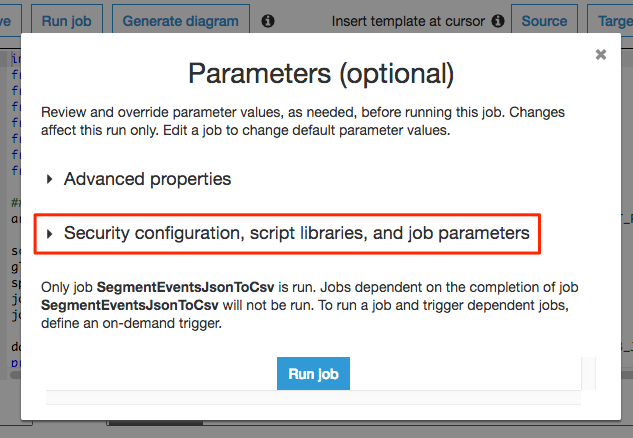

Scroll down to the "Job parameters" section. This is where we will specify the job parameters that our script expects for the path to the input data and the path to the output file. Create two job parameters with the following key and value. Be sure to prefix each key with `--` as shown. Substitute your account ID for `[ACCOUNT_ID]` in the values below. You copy the bucket name to your clipboard from the S3 service page in the tab/window you opened above. 

| Key                  | Value                                          |
| -------------------- | ---------------------------------------------- |
| --S3_CSV_OUTPUT_PATH | s3://personalize-data-[ACCOUNT_ID]/transformed |

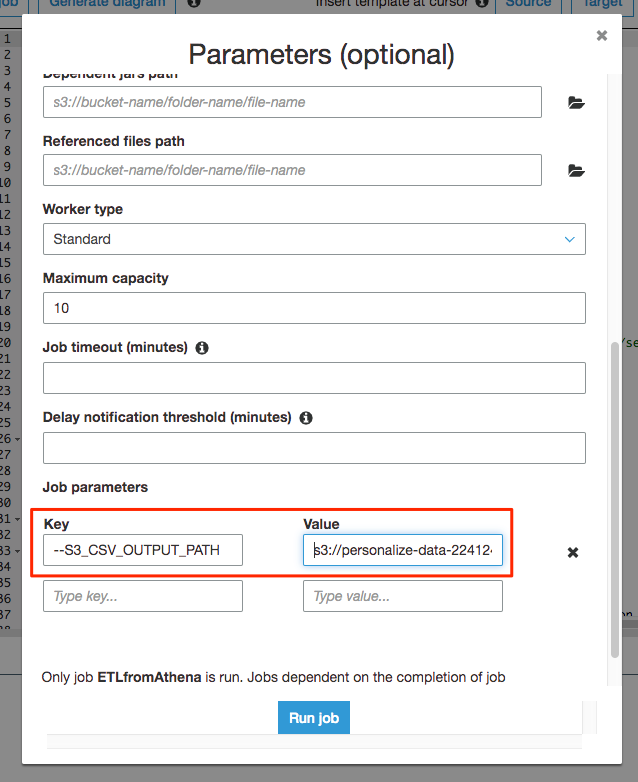

Click the "Run job" button to start the job. Once the job has started running you will see log output in the "Logs" tab at the bottom of the page. It may take a few minutes to start the execution of your job and several minutes to complete. Once your job starts executing, you can also view the log output in CloudWatch > Logs > `/aws-glue/jobs/output` while it is running.

When the job completes click the "X" in the upper right corner of the the page to exit the job script editor.

### Verify CSV Output File

Browse to the S3 service page in the AWS console and find the bucket with a name starting with `personalize-data-...`. Click on the bucket name. If the job completed successfully you should see a folder named "transformed". Click on "transformed" and you should see the output file created by the ETL job. If the file is missing or is empty then the job likely experienced a problem. You can review the job's log under CloudWatch > Logs > `/aws-glue/jobs/output` to troubleshoot possible errors. Otherwise, you can skip the ETL step and upload a pre-generated CSV located in the [data/transformed](../data/transformed) directory of this repository (i.e. upload the pre-generated file to your `personalize-data-...` S3 bucket in the `transformed` folder using the AWS console).

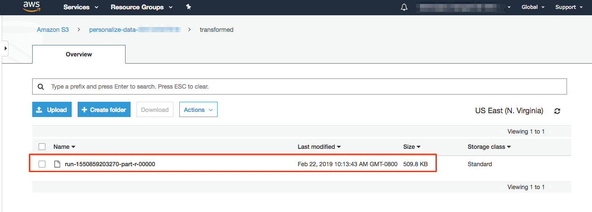

At this point we have the transformed CSV file containing historical clickstream data that we will use to upload and train a model in Personalize. In the next [exercise](../exercise2/) we will create a Personalize Dataset Group and import the CSV as an interaction dataset.
