# Exercise 2 - Create Personalize Dataset Group, Solution, and Campaign

## Overview

Amazon Personalize requires data, uploaded into Amazon Personalize datasets, to train a model.

You have two means to provide the training data. You can import historical data from an Amazon S3 bucket, and you can record data as it is created. In [exercise 1](../exercise1) we learned how to prepare historical data provided by Segment and in [exercise 4](../exercise4) we will learn how to send real-time events to Personalize using the Segment Personalize destination.

A dataset group contains related datasets, three created by you (users, items, and historical interactions), and one created by Amazon Personalize for live event interactions. A dataset group can contain only one of each kind of dataset.

You can create dataset groups to serve different purposes. For example, you might have an application that provides recommendations for purchasing shoes and another that gives recommendations for places to visit in Europe. In Amazon Personalize, each application would have its own dataset group.

Historical data must be provided in a CSV file. Each dataset type has a unique schema that specifies the contents of the file.

There is a minimum amount of data that is necessary to train a model. Using existing historical data allows you to immediately start training a solution. If you ingest data as it is created, and there is no historical data, it can take a while before training can begin.

You can use the Amazon Personalize console to import data into a dataset. Alternatively you can use the AWS SDK.

### What You'll Be Building


In the previous [exercise](../exercise1/) we learned how to use AWS Glue to take the raw event data written to S3 by Segment and transform it into the format required by Personalize. In this exercise we will pick up where we left off and learn how to create a dataset group and campaign in Personalize by performing the following steps.

* Create a dataset group in Personalize
* Define the schema representing the event data in our CSV
* Upload our CSV into an interaction dataset in the dataset group
* Create a Personalize Solution, or machine learning model, using the data in the dataset group and a Personalize recipe

### Exercise Preparation

If you haven't already cloned this repository to your local machine, do so now.

```bash
git clone https://github.com/james-jory/segment-personalize-workshop.git
```

## Part 1 - Create Personalize Dataset Group

Browse to the Amazon Personalize service landing page in the AWS console, making sure that you are still in the "N. Virginia" region.

Click the "View dataset groups" button to get started.

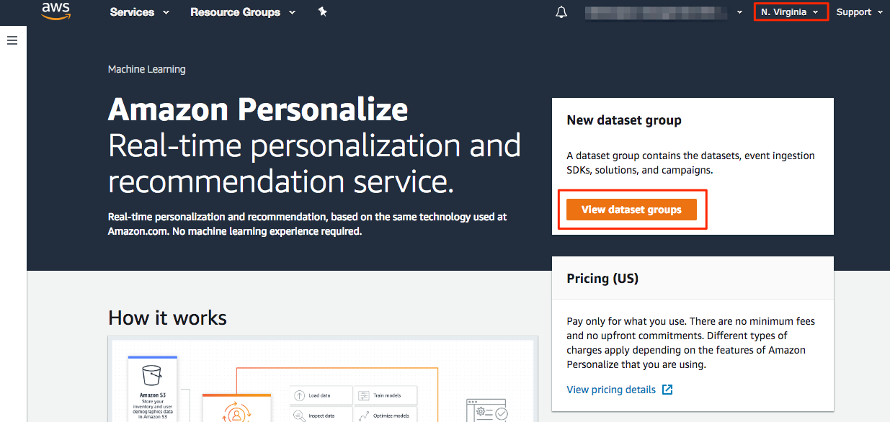

On the Dataset Groups page, click the "Create dataset group" button.

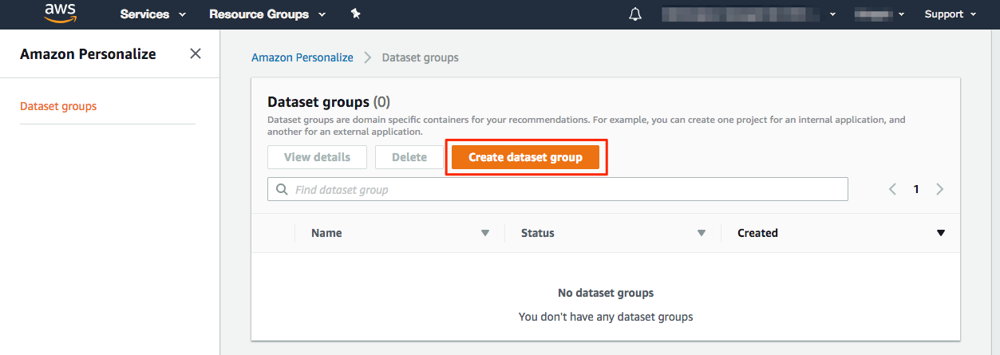

On the "Create dataset group" page, give your dataset group a name. Select the "Upload user-item interaction data" radio button since we will be uploading the CSV we prepared in the [previous exercise](../exercise1). Click "Next" to contiue.

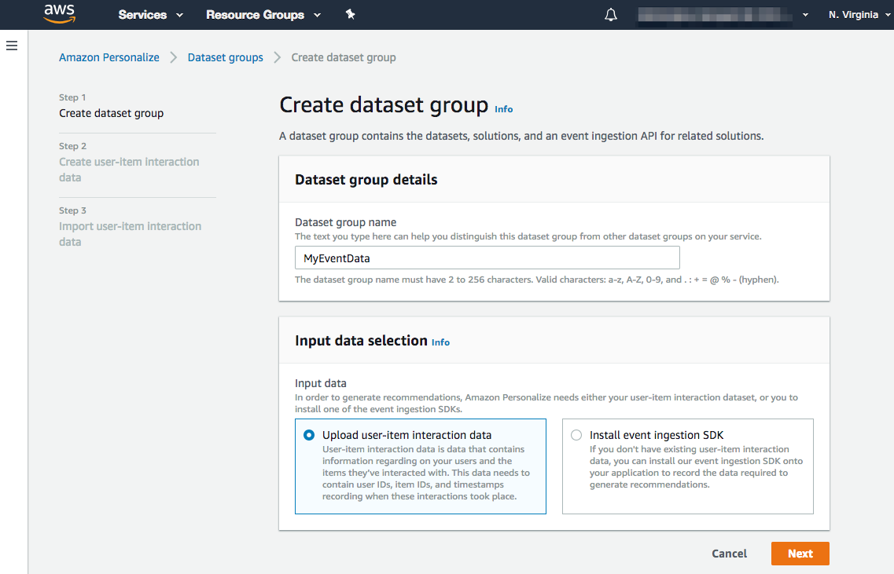

On the "Create user-item interaction data" page, select the "Create new schema" radio button and give your schema a name.

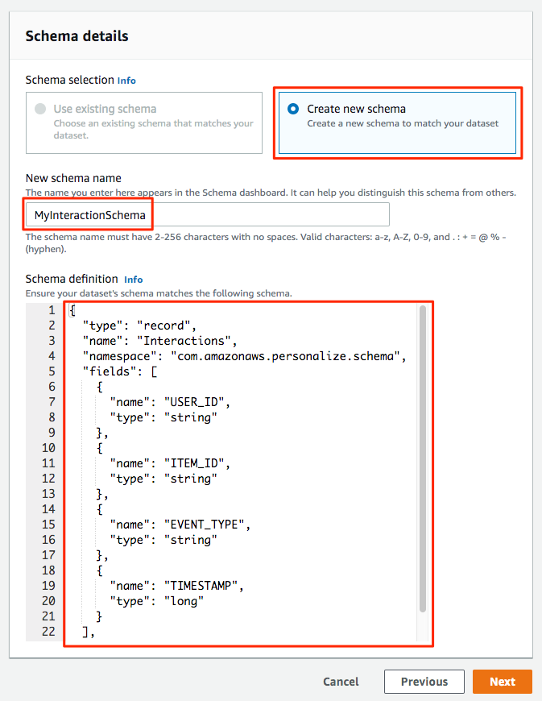

Scroll down to the "Schema definition" editor. Dataset schemas in Personalize are represented in [Avro](https://avro.apache.org/docs/current/spec.html).

> Avro is a remote procedure call and data serialization framework developed within Apache's Hadoop project. It uses JSON for defining data types and protocols, and serializes data in a compact binary format.

An Avro schema for our event data has already been written and can be found in [event_schema.avsc](event_schema.avsc) and is also displayed below.

```json
{
    "type": "record",
    "name": "Interactions",
    "namespace": "com.amazonaws.personalize.schema",
    "fields": [
        {
            "name": "USER_ID",
            "type": "string"
        },
        {
            "name": "ITEM_ID",
            "type": "string"
        },
        {
            "name": "EVENT_TYPE",
            "type": "string"
        },
        {
            "name": "TIMESTAMP",
            "type": "long"
        }
    ],
    "version": "1.0"
}
```

Let's review the schema in more detail. The required fields for the user-item interaction dataset schema are `USER_ID`, `ITEM_ID`, and `TIMESTAMP`. Additionally, optional reserved fields include `EVENT_TYPE` and `EVENT_VALUE`. In the [previous exercise](../exercise1) we mapped the `userId`, `properties.sku`, `timestamp` (transformed from ISO 8601 to UNIX time), and `event` from the raw event data from Segment to `USER_ID`, `ITEM_ID`, `TIMESTAMP`, and `EVENT_TYPE` columns in the CSV, respectively.

Copy the contents of Avro schema to your clipboard and paste it into the "Schema definition" editor (replacing the proposed schema). Click "Next" to save the schema and move to the next step.

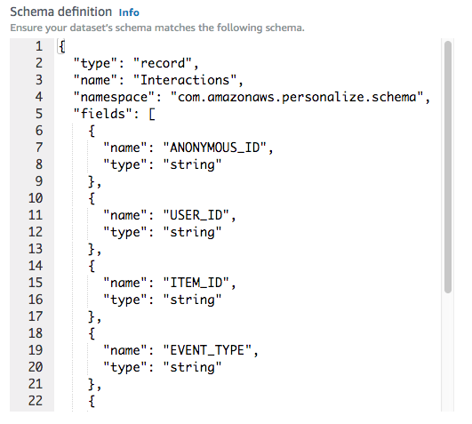

The "Import user-item interaction data" step is displayed next. To complete this form we will need to get two pieces of information from IAM and S3. Give your import job a name. For the "IAM service role", select "Enter a customer IAM role ARN" from the dropdown. For instructions on completing the remaining fields, see the instructions below.

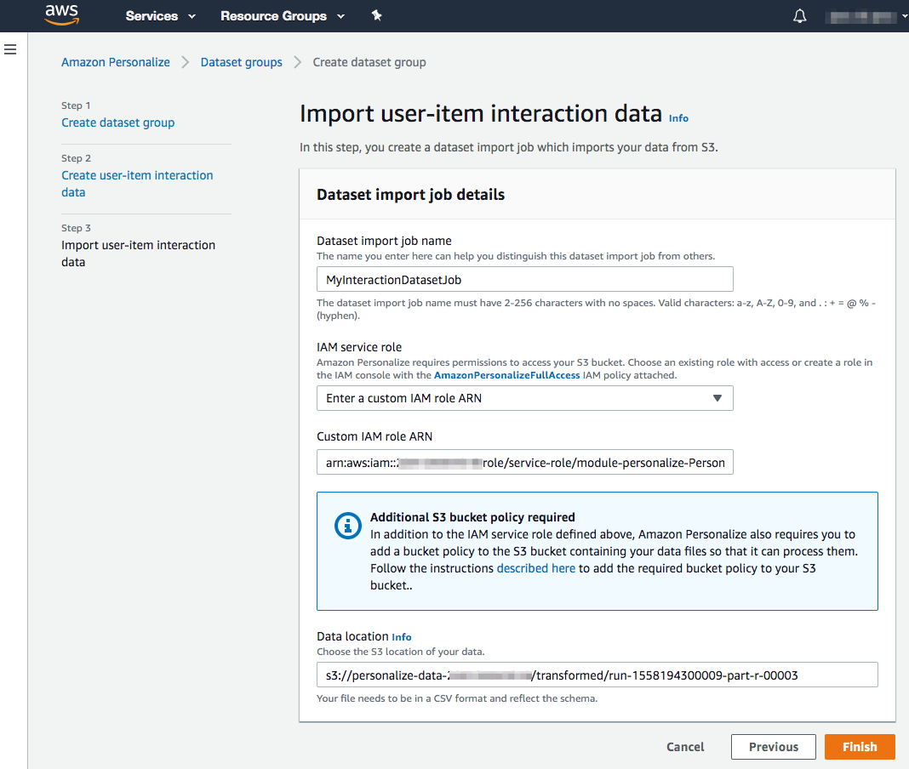

To obtain the IAM and S3 information we need to complete this form, we need to keep the current page open while opening a new tab or window to find the needed information. We'll start with the IAM role.

1. Open up a new browser window or tab in your current console session by right-clicking on the "AWS" logo in the upper-left corner of the page and choosing "Open Link in New Tab" or "Open Link in New Window" (the menu options may be worded differently in the web browser you're using).
2. In the __new tab/window that was opened__, browse to the IAM service page.
3. Select "Roles" in the left navigation and find the IAM role with the name "module-personalize-PersonalizeExecutionRole-...".
4. Click on this role name to display the role's detail page.
5. The "Role ARN" is displayed at the top of the "Summary" section. Click on the copy icon displayed at the end of Role ARN to copy the ARN to your clipboard. 
6. Switch browser tabs/windows back to the Personalize "Import user-item interaction data" form and paste the ARN into the "Custom IAM role ARN" field.

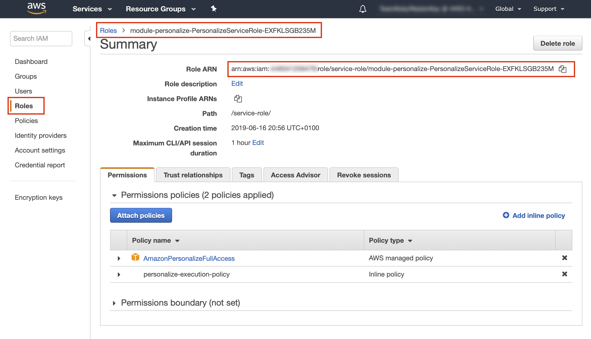

To complete the form, we need the path in S3 where our transformed CSV is located. To find this path, complete the following steps.

1. Open up a new browser window or tab in your current console session by right-clicking on the "AWS" logo in the upper-left corner of the page and choosing "Open Link in New Tab" or "Open Link in New Window" (the menu options may be worded differently in the web browser you're using).
2. In the __new tab/window that was opened__, browse to the S3 service page.
3. Locate the S3 bucket starting with the name "personalize-data-...". Click on the bucket name.
4. Click on the "transformed" folder name. You should see an object named something like "run-1551018703844-part-r-00000". This is the CSV generated by our Glue ETL job in the [previous exercise](../exercise1). ***Make sure that this file is not zero bytes in size (which would indicate that the ETL job did not complete successfully).*** If your file is empty or you want to skip the ETL step, you can upload a pre-generated CSV located in the [data/tranformed](../data/transformed) directory of this repository to your S3 bucket.
5. Check the box or click on the object name and then click "Copy path" to copy the path to the file to your clipboard.
6. Switch browser tabs/windows back to the Personalize "Import user-item interaction data" form and paste the CSV path into the "Data location" field.

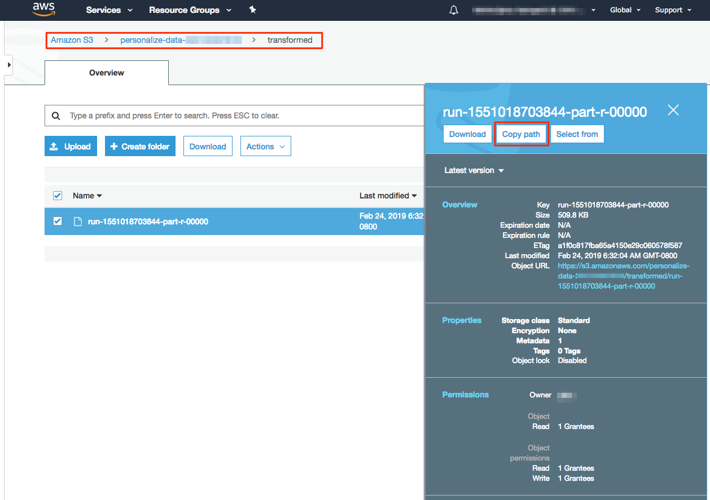

After clicking the "Finish" (or "Start import") button at the bottom of the page, you will be returned to the Personalize Dashboard where you can monitor the progress of your interaction dataset as it is being created. This process can take several minutes to complete.

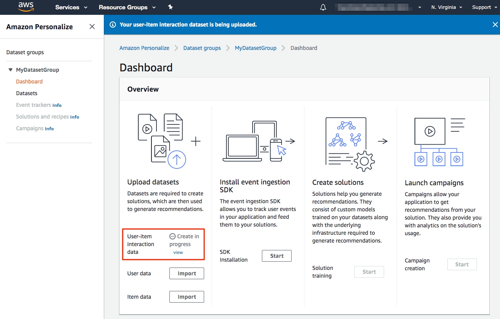

## Part 2 - Create Personalize Solution

Once our event CSV is finished importing into a user-item interaction dataset, we can create a Personalize Solution. This is where the ML model is created. From the Dashboard page for the dataset group we created above, click the "Start" button in the "Create solutions" column.

> We are skipping the event ingestion step for now and will come back to it in [exercise 4](../exercise4).

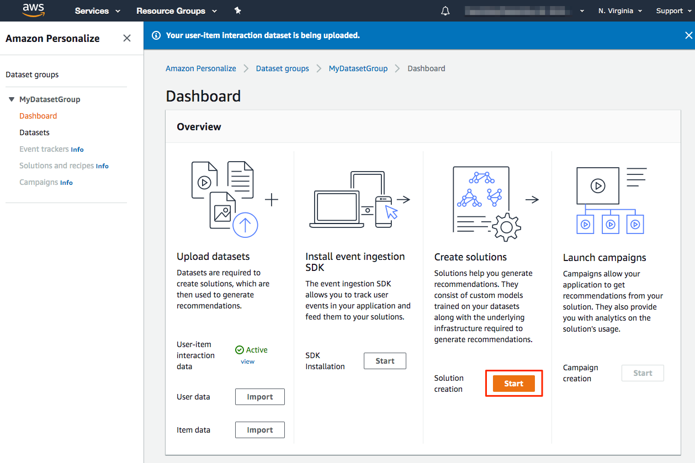

On the "Create solution" page, enter a "Solution name". When an interaction dataset includes multiple event types, you can tell Personalize which event type to train on. This is optional and we will leave it blank for this exercise. For the "Recipe selection", select the "Manual" radio button and "aws-hrnn" as the "Recipe". In the interest of time, we are manually selecting a recipe rather using the AutoML option. The AutoML process takes longer to build a Solution since Personalize will evaluate multiple recipes to find the best performing recipe and configuration. See the [Predefined Recipes](https://docs.aws.amazon.com/personalize/latest/dg/working-with-predefined-recipes.html) documentation to learn more.

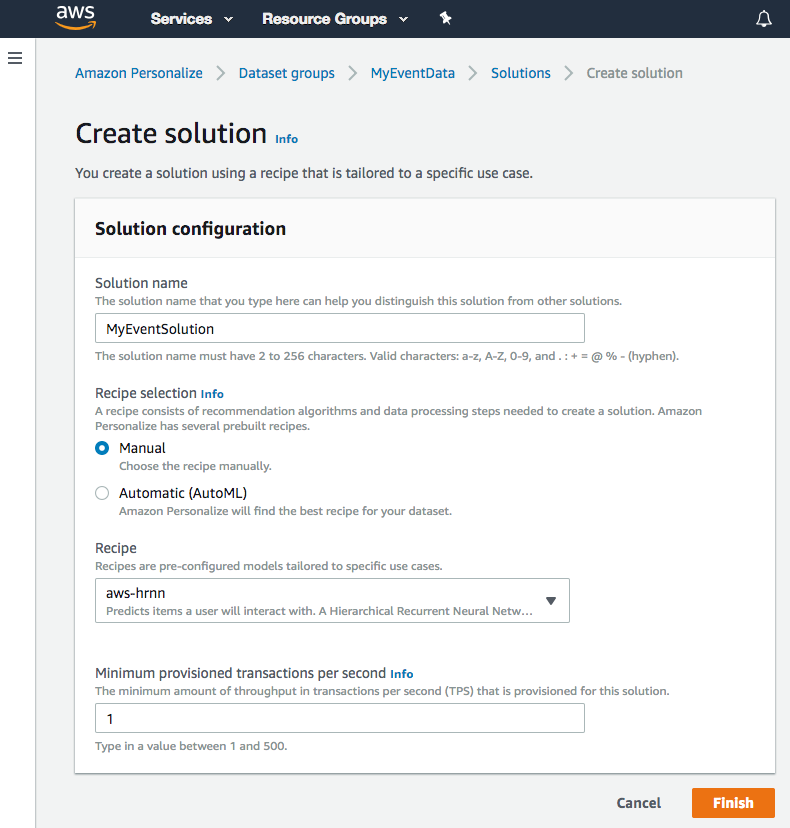

Click the "Finish" button to create your Solution. This process can take several minutes to complete.

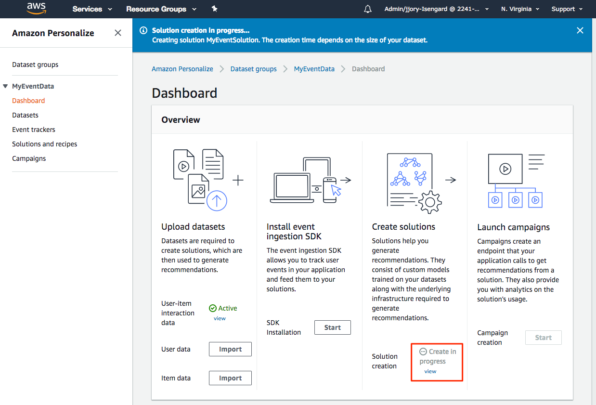

## Part 3 - Create Personalize Campaign

A deployed solution is known as a campaign, and is able to make recommendations for your users. To deploy a solution, you create a campaign in the console or by calling the CreateCampaign API. You can choose which version of the solution to use. By default, a campaign uses the latest version of a solution.

From the Dataset Group Dashboard, click the "Create new campaign" button.

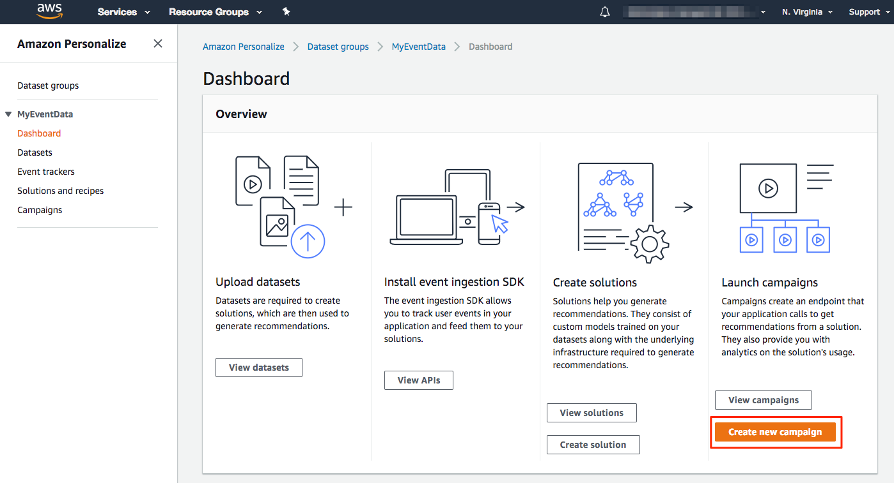

Enter the name for your campaign as `segment-workshop-campaign`. __You must use this name in order for subsequent exercises in this workshop to function properly__. Select the solution your created above and click "Create campaign".

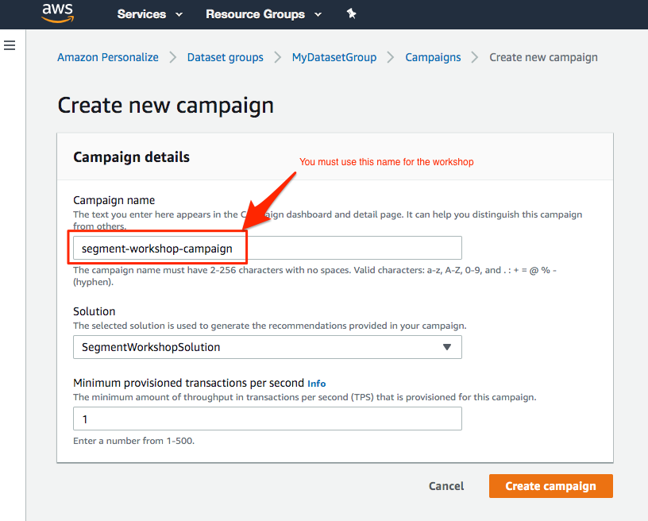

Personalize will start creating your new campaign. This process can take several minutes.

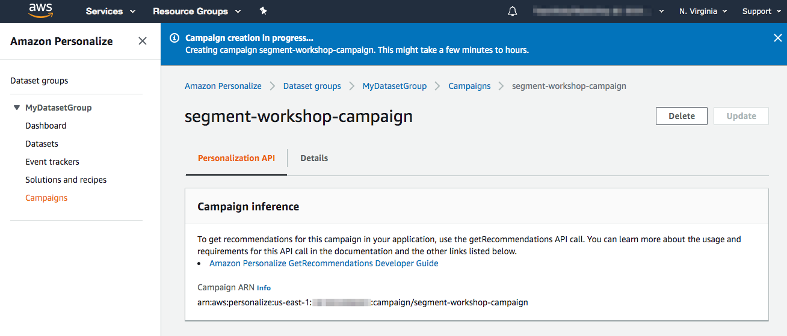

Once your campaign has finished being created and deployed, you can use the AWS console to test the Personalize "GetRecommendations" endpoint. Enter a `USER_ID` from the CSV we imported earlier or try entering a made up user ID (i.e. simulating a new user not present in the training set).

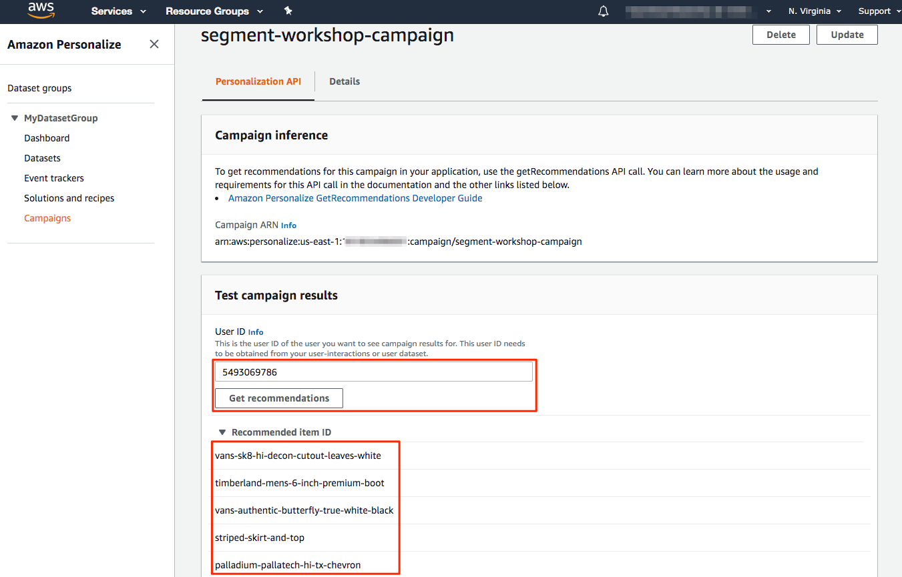

In the [next exercise](../exercise3) we will build an API endpoint using Amazon API Gateway and Amazon Lambda to demonstrate how recommendations from your Personalize campaign can be integrated into your applications.