# Exercise 3 - Real-Time Data Collection & Recommendation Optimization

## Overview

Amazon Personalize can make recommendations based purely on historical data as we covered using historical data from Segment in [Exercise 1](../exercise1) and [Exercise 2](../exercise2). Amazon Personalize can also make recommendations purely on real-time clickstream data, or a combination of both, using the Amazon Personalize event ingestion SDK.

> Note: A minimum of 1000 records of combined interaction data is required to train a model.

The event ingestion SDK includes a JavaScript library for recording events from web client applications. The SDK also includes a library for recording events in server code.

### What You'll Be Building

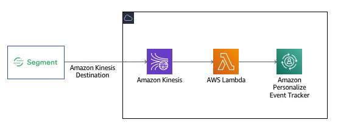

In this exercise we will be leveraing the data collection capabilities of Segment to stream clickstream data to a Kinesis Stream in real-time. A Lambda function will consume events from this stream, transform the events it consumes into the parameters required by Personalize, and then update Personalize.

* Create Kinesis Stream
* Create and configure a Kinesis Stream destination in Segment
* Send test events through the destination in Segment to Kinesis
* Create Lambda function that consumes events from Kinesis and writes to Personalize using the [PutEvents](https://docs.aws.amazon.com/personalize/latest/dg/API_UBS_PutEvents.html) API

### Exercise Preparation

If you haven't already cloned this repository to your local machine, do so now.

```bash
git clone https://github.com/james-jory/segment-personalize-workshop.git
```

## Part 1 - Create Kinesis Stream

We'll start by creating a Kinesis Stream in AWS that will be the sink for events sent by Segment. Login to the AWS account for this workshop and browse to the Kinesis service page. Click on the "Create data stream" button.

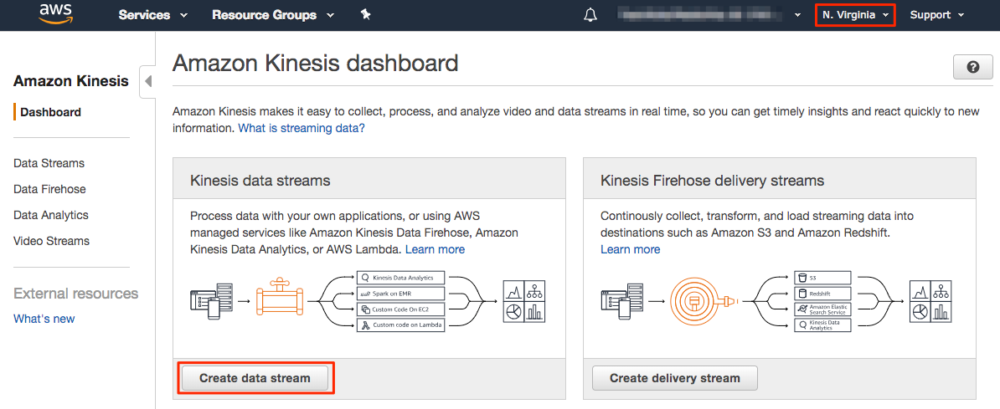

On the "Create Kinesis stream" page, enter the stream name as "SegmentDestinationStream". __You must name your stream "SegmentDestinationStream" since there are IAM roles that have been pre-provisioned based on this stream name__. A shard count of "1" will be more than adequate for the workshop. Click the "Create Kinesis stream" button at the bottom of the page to create the stream.

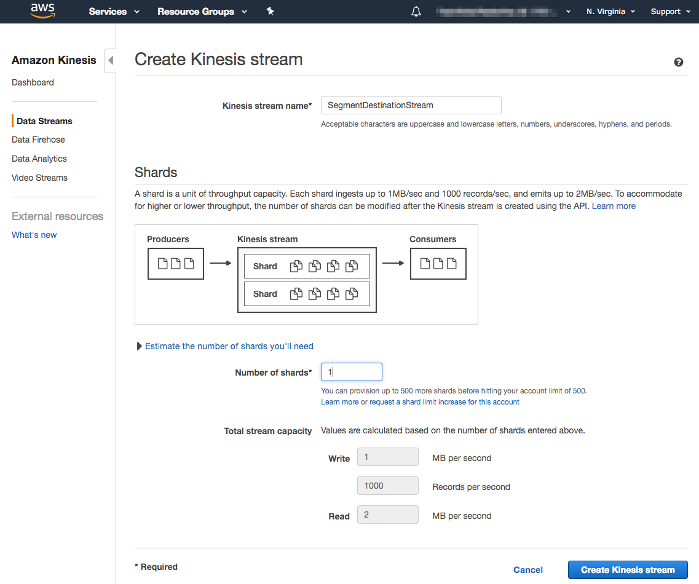

After a few moments your Kinesis stream will be created and ready for use.

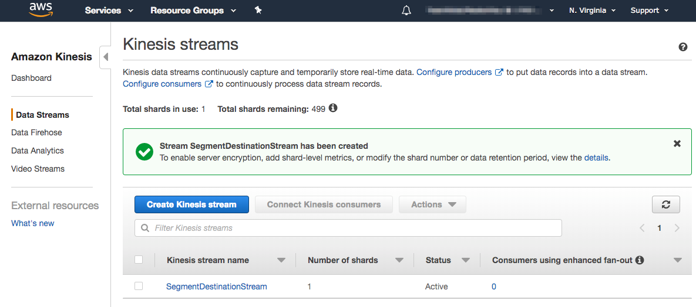

## Part 2 - Create Kinesis Stream Destination in Segment

Now that we have a stream to receive events, let's setup a Kinesis Stream destination in Segment. Before we can setup a destination, though, you must have a Source configured. If you don't have a Source configured, use a website Javascript or Node.js source.

To setup a Destination for Kinesis, click "Destinations" in the left navigation and then click the "Add Destination" button.

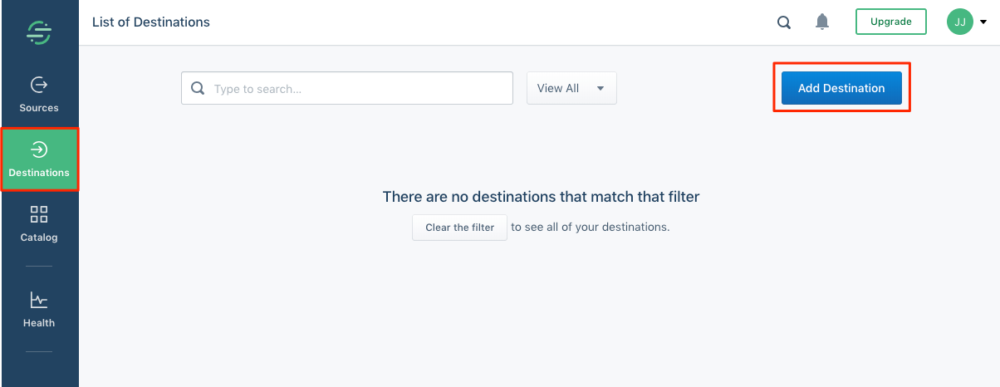

On the Destinations catalog page, enter "kinesis" in the search field and click on "Amazon Kinesis" in the search results.

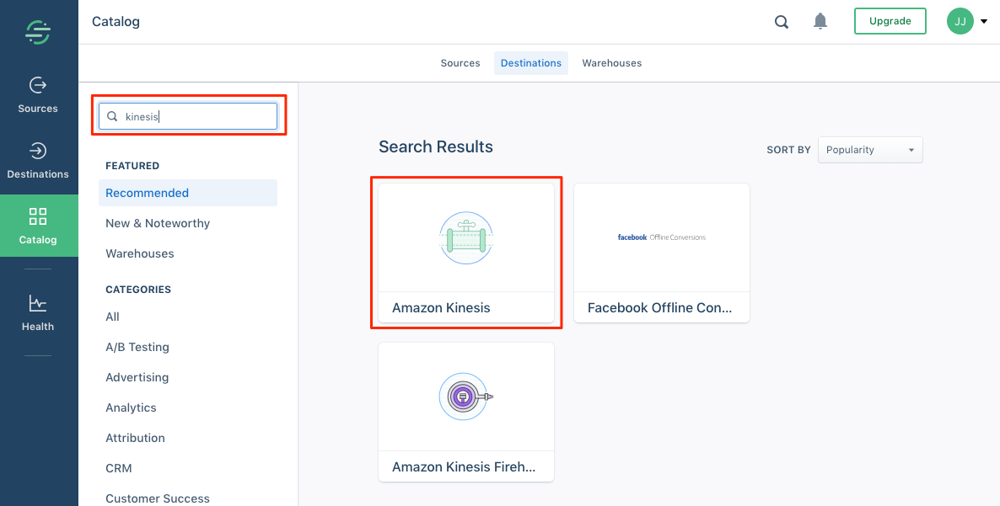

Click the "Configure Amazon Kinesis" button.

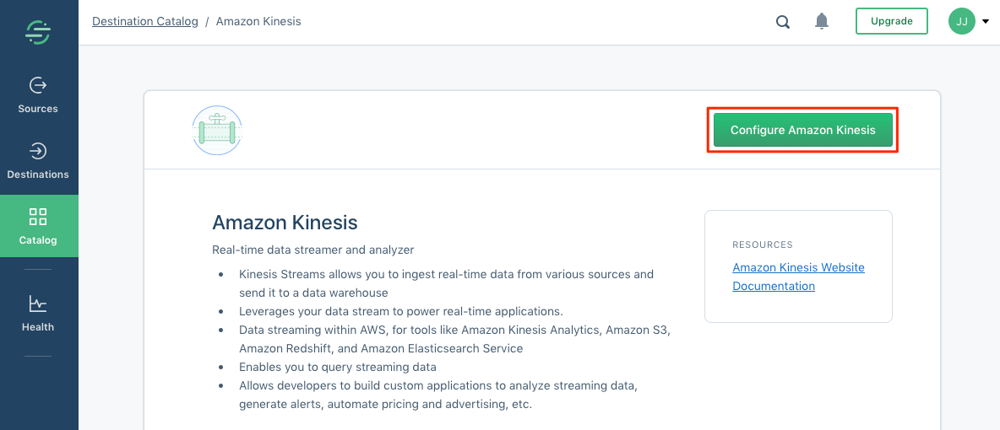

Select the source to use with this destination and click the "Confirm Source" button.

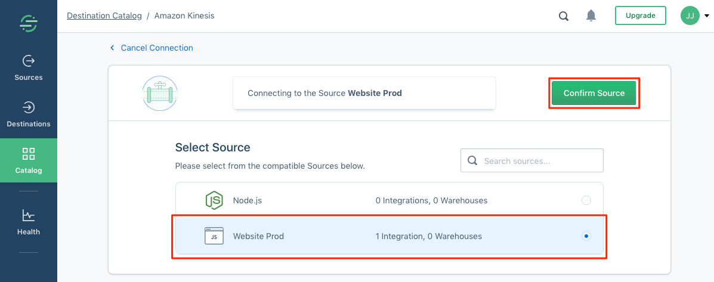

One of the required parameters for configuring the Kinesis destination is an IAM Role ARN. This role must have a cross-account trust policy that will allow Segment to write to the Kinesis in your account from their AWS account. A role has already been pre-provisioned in the AWS account used for the workshop. We just need to copy the ARN to the clipboard.

1. Open a new browser tab/window and login to your AWS account for the workshop.
2. Browse to the IAM service page.
3. Click on Roles in the left navigation and locate the role with a name that starts with `personalize-module-SegmentKinesisRole-...`.
4. Click on the role name to view the role details.
5. At the top of the page where the "Role ARN" is displayed, click on the copy icon at the end of the line.
6. Switching back to your Segment tab/window, paste the Role ARN into the Role Address field.

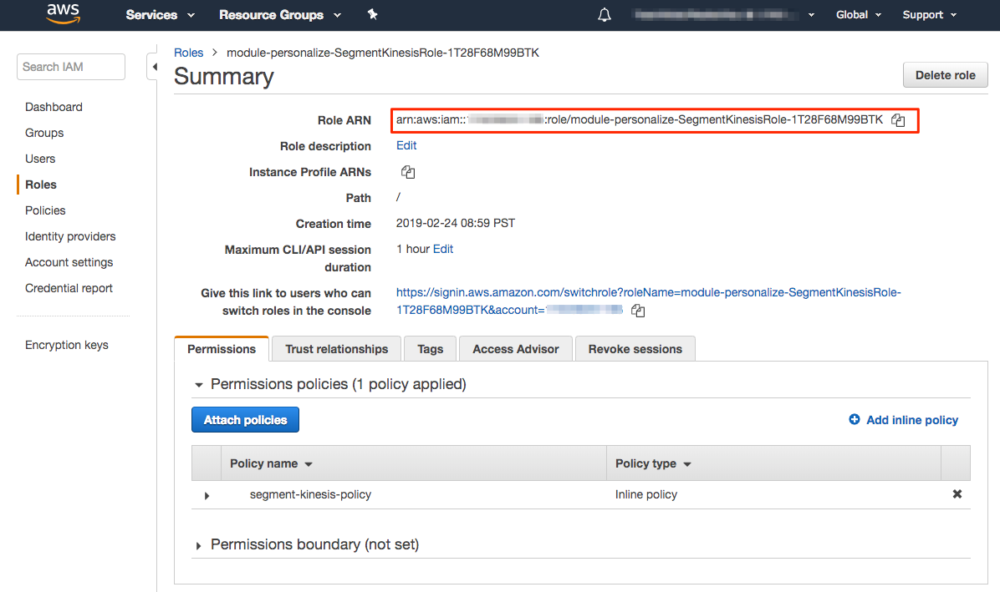

Complete the "Amazon Kinesis Settings" page by entering "us-east-1" for the AWS region, "123456789" for the Secret ID, and "SegmentDestinationStream" for the stream name. Finally, be sure to enable this destination at the top of the page.

> We are using "123456789" for the Secret ID for this workshop so that it will match the IAM policy that is pre-provisioned for all attendees. For production deployments you will want to use a more suitably unique secret.

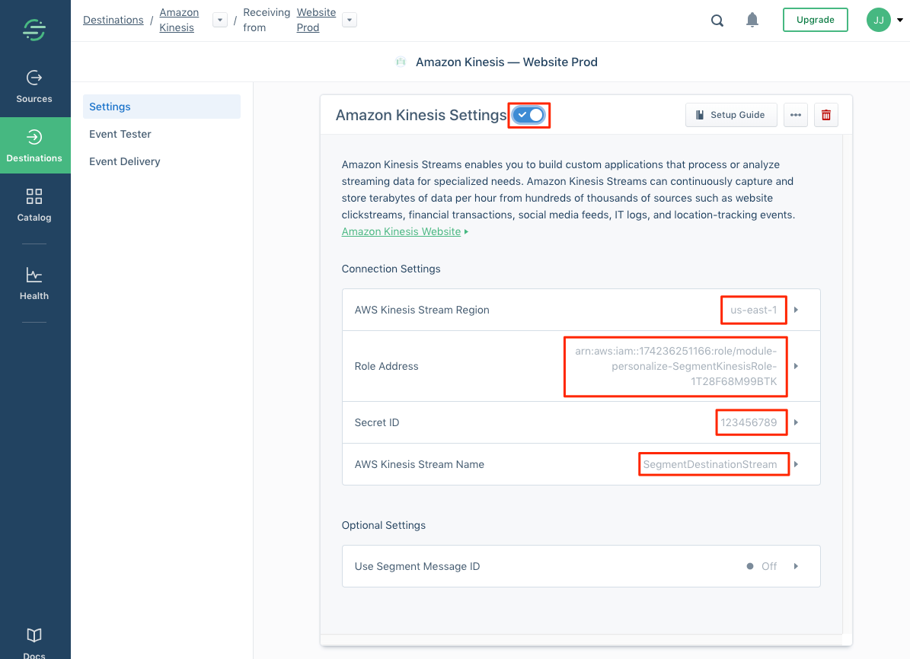

## Part 3 - Test Kinesis Destination using Event Tester

In your Segment account, click on the Event Tester for the Kinesis Destination just created above. Edit the JSON for the test event to include a `sku` field inside `properties`. Set the `sku` value to `ocean-blue-shirt` (which is a SKU in our test dataset), change the `userId` to `2941404340` (which also a valid user in our dataset), and change the event to `Product Clicked`. Finally, add an `anonymousId` field to the JSON document since our ETL job references it as well.

```json
{
  "messageId": "test-message-33dlvn",
  "timestamp": "2019-02-25T15:55:05.905Z",
  "type": "track",
  "email": "test@example.org",
  "properties": {
    "sku": "ocean-blue-shirt",
    "property2": "test",
    "property3": true
  },
  "userId": "2941404340",
  "anonymousId": "2941404340",
  "event": "Product Clicked"
}
```

Click the "Send Event" button to send this event to Kinesis. You should see a 200/success response in the right panel. Send the event 5-10 more times to add multiple events to the stream (and enough to complete a batch for the Lambda consumer function that we will be building in the next part of this exercise).

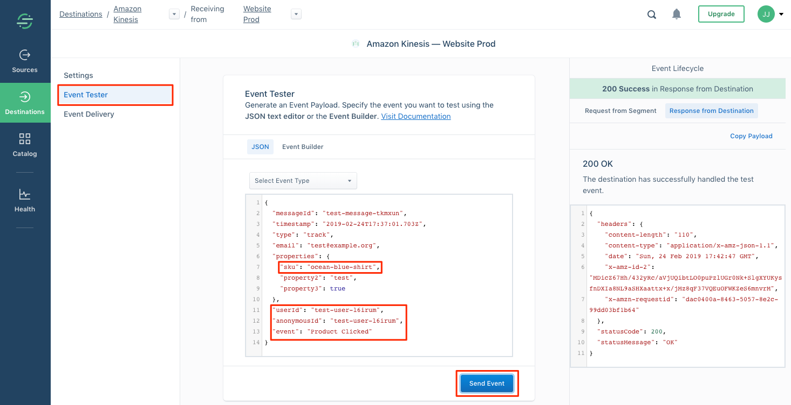

You can verify that the events are being received by Kinesis by inspecting the "Monitoring" tab on the stream's detail page in the AWS console. Login to your AWS account for the workshop, browse to the Kinesis service page, and click the "Data Streams" link in the left navigation. Click on the "SegmentDestinationStream" stream and then the "Monitoring" tab.


Scroll down to where some of the "PutRecord" metrics are displayed. It may take a minute or two before the graphs are updated. Click the refresh icon button to update the metrics.

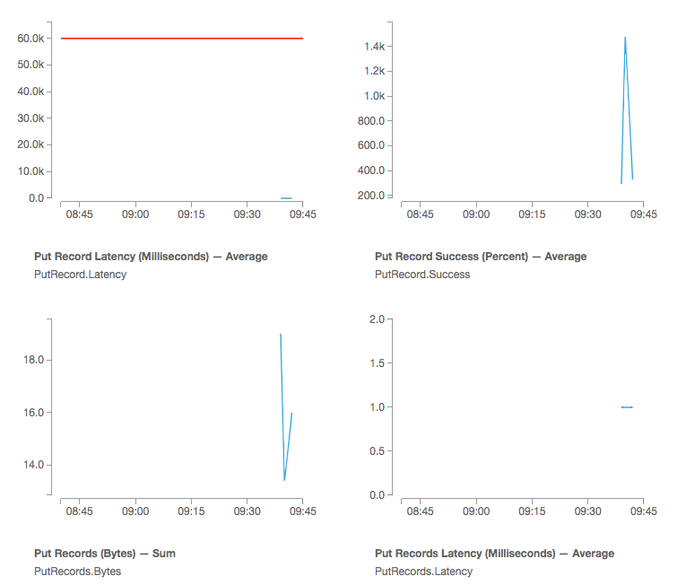

## Part 4 - Build Lambda Function to Process Kinesis Stream

To complete our real-time event pipeline we'll build a Lambda function that consumes events from the "SegmentDestinationStream" stream, transforms the field events we need to update Personalize, and finally calling the Personalize Record API on a Personalize Event Tracker.

Start by browsing to the Lambda service page in the AWS account you have been assigned for the workshop. Click the "Create a function" button to create a new function.

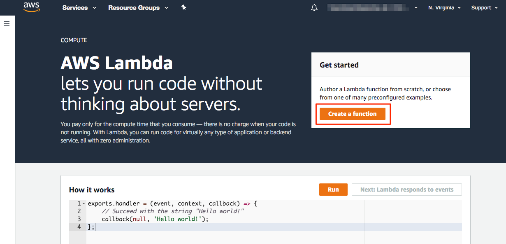

Select the "Author from scratch" radio button since we will be providing the source code for the function. Enter a name for your function and select Python 3.7 for the runtime. For the Role field, select "Choose an existing role" from the dropdown. Your AWS account already includes a pre-provisioned role starting with the name `personalize-module-SegmentKinesisHandlerRole-...`. Select that role and click the "Create function" button.


### Lambda Function Source Code

Scroll down to the "Function code" panel. Since the function has already been written for you, we need to replace the base function code provided by Lambda with our function source code. The complete function can be found at [segment_kinesis_consumer/lambda_function.py](segment_kinesis_consumer/lambda_function.py) and is displayed below.

```python
import base64
import boto3
import json
import os
import dateutil.parser as dp
import init_personalize_api as api_helper

def lambda_handler(event, context):
    """ Consumes events from the Kinesis Stream destination configured in Segment.
    See the Segment documentation for how to setup Kinesis: https://segment.com/docs/destinations/amazon-kinesis/
    """

    if not 'personalize_tracking_id' in os.environ:
        raise Exception('personalize_tracking_id not configured as environment variable')

    # Initialize Personalize API (this is temporarily needed until Personalize is fully
    # integrated into boto3). Leverages Lambda Layer.
    api_helper.init()

    print("event: " + json.dumps(event))

    personalize_events = boto3.client('personalize-events')

    for record in event['Records']:
        print("Payload: " + json.dumps(record))
        segment_event = json.loads(base64.b64decode(record['kinesis']['data']).decode('utf-8'))
        print("Segment event: " + json.dumps(segment_event))

        # For the Personalize workshop, we really only care about these events
        supported_events = ['Product Added', 'Order Completed', 'Product Clicked']
        if ('anonymousId' in segment_event and
            'userId' in segment_event and
            'properties' in segment_event and
            'sku' in segment_event["properties"] and
            'event' in segment_event and
            segment_event['event'] in supported_events):
            print("Calling Personalize.put_events()")
            properties = { "id": segment_event["properties"]["sku"] }
            personalize_events.put_events(
                trackingId = os.environ['personalize_tracking_id'],
                userId = segment_event['userId'],
                sessionId = segment_event['anonymousId'],
                eventList = [
                    {
                        "eventId": segment_event['messageId'],
                        "sentAt": int(dp.parse(segment_event['timestamp']).strftime('%s')),
                        "eventType": segment_event['event'],
                        "properties": json.dumps(properties)
                    }
                ]
            )
        else:
            print("Segment event does not contain required fields (anonymousId, sku, and userId)")
```

Our function iterates over the `event[Records]`, inspecting the payload for each record for a qualiying event, and then calls the Personalize Record endpoint for our Event Tracker. Logic of interest in the `for` loop includes specifying the `itemId` in the `properties` field from the `properties.sku` field in the Segment event and converting the timestamp from ISO 8601 to a UNIX timestamp as we saw in the ETL job in [Exercise 1](../exercise1).

Copy the full source code above (or from the [file](segment_kinesis_consumer/lambda_function.py)) to your clipboard and paste over the source currently in the function code editor.

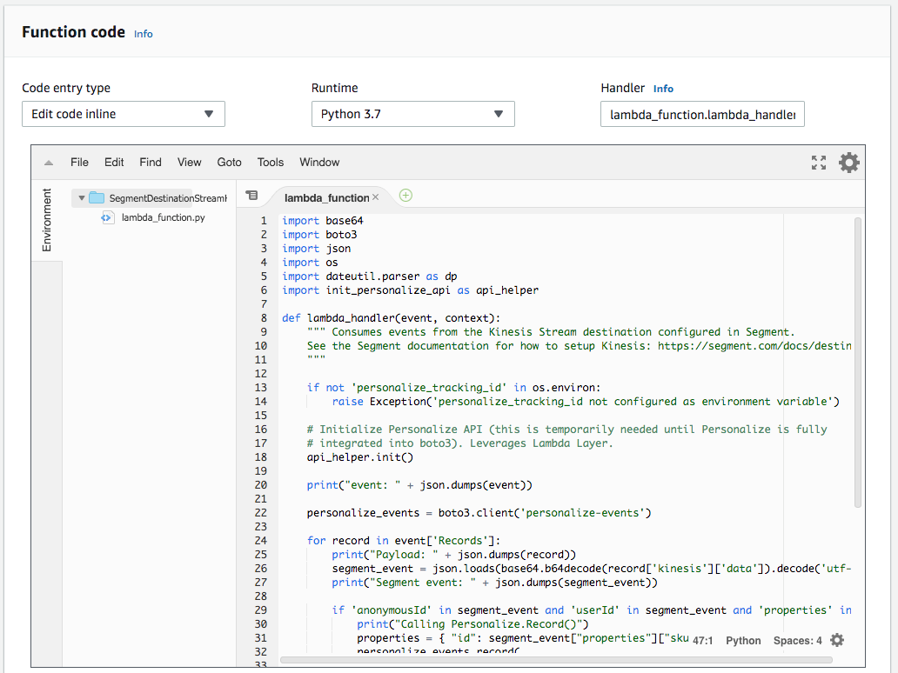

Click the "Save" button at the top of the page to save your function.

### Wire up Personalize API using Lambda Layer (Preview only)

You will notice in the function source the following `import` and function call.

```python
import of import init_personalize_api as api_helper
...
api_helper.init()
```

This `import` and function call utilize some boilerplate code, packaged as a [Lambda Layer](https://docs.aws.amazon.com/lambda/latest/dg/configuration-layers.html), needed to configure the Personalize API with the AWS Python SDK. This is only necessary while Personalize is in Preview. Once Personalize is GA and the API is bundled with the Python SDK, as well as other language SDKs, this supporting Layer will no longer be needed. For now, though, we need to install this Layer once so we can use it across the functions we build in this workshop.

To install our Layer, open the Lambda navigation panel and click "Layers".


From the Lambda Layers view, click the "Create layer" button.


Create the layer by specifying a name such as "PersonalizeApiInstaller", browsing to the pre-made zip in this repository at `support/layer/python_personalize_init.zip`, and selecting Python 3.7 as the compatible runtime. Click the "Create" button to upload the zip file and create the layer.


Next we need to add the layer just created to our function. Return to the Lambda function by opening the Lambda navigation panel and clicking "Functions".


Click on your function name to access the configuration page again. In the Lambda Designer, click the "Layers" panel below the function name and then the "Add layer" button in the "Referenced layers" panel at the bottom of the page.


Select the layer we just added and the latest version. Click "Add" to add the layer to the function.


### Wire-up Personalize Event Tracker

Another dependency in our function is the ability to call the Personalize [PutEvents API](https://docs.aws.amazon.com/personalize/latest/dg/API_UBS_PutEvents.html) endpoint as shown in the following excerpt.

```python
personalize_events.put_events(
    trackingId = os.environ['personalize_tracking_id'],
    userId = segment_event['userId'],
    sessionId = segment_event['anonymousId'],
    eventList = [
        {
            "eventId": segment_event['messageId'],
            "sentAt": int(dp.parse(segment_event['timestamp']).strftime('%s')),
            "eventType": segment_event['event'],
            "properties": json.dumps(properties)
        }
    ]
)
```

The `trackingId` function argument identifies the Personalize Event Tracker which should handle the events we submit. This value is passed to our Lambda function as an Environment variable. Let's create a Personalize Event Tracker for the Dataset Group we created in [Exercise 2](../exercise2).

In another browser tab/window, browse to the Personalize service landing page in the AWS console. Click on the Dataset Group created in [Exercise 2](../exercise2) and then "Event trackers" in the left navigation. Click the "Create event tracker" button.

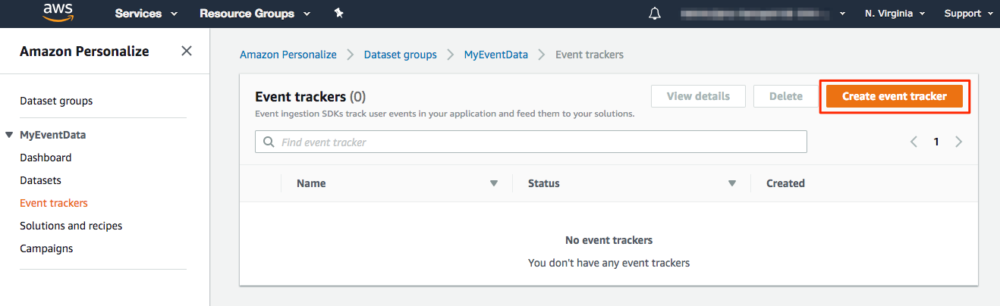

Enter a name for your Event Tracker and select the pre-provisioned CloudWatch IAM role that starts with `personalize-module-PersonalizeExecutionRole-..`. If the IAM role is not present, select "Enter a custom IAM role ARN" and paste the IAM ARN for the role (obtained from IAM service page for the role name like `personalize-module-PersonalizeExecutionRole-..`). Click the "Next" button to create the tracker.

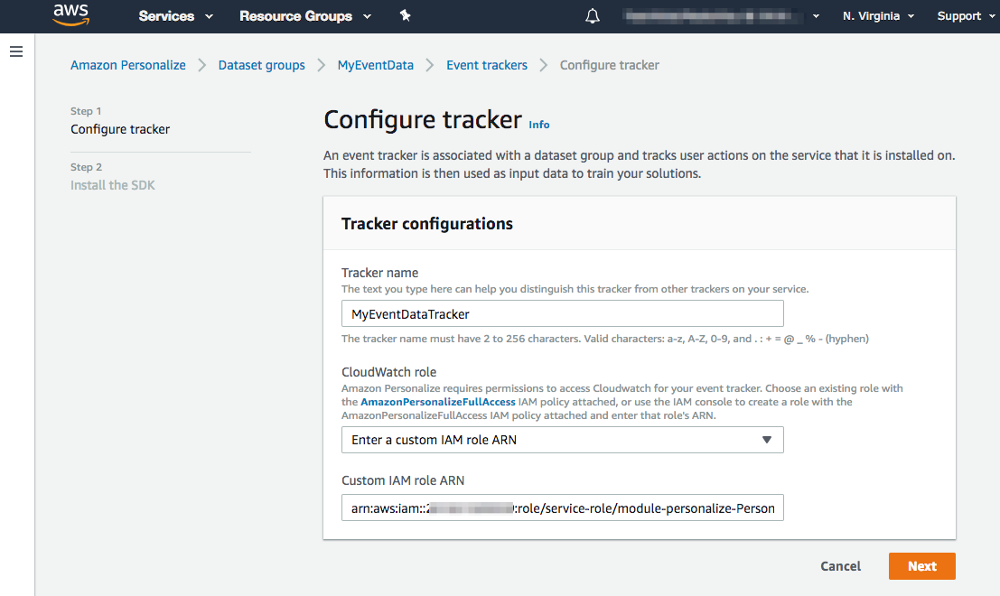

The Event Tracker's tracking ID is displayed on the following page and is also available on the Event Tracker's detail page. Copy this value to your clipboard.

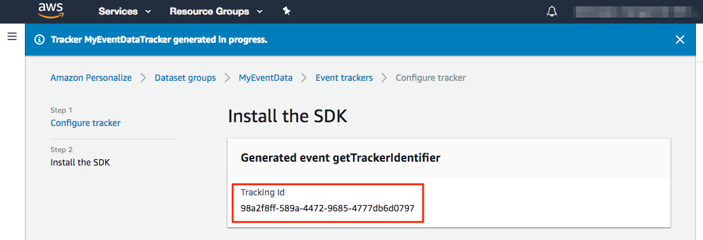

Returning to our Lambda function, paste the Event Tracker's tracking ID into an Environment variable for our function with the key `personalize_tracking_id`.

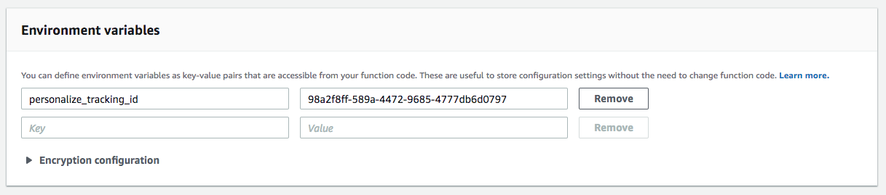

### Wire-up Kinesis Stream as Trigger

Now that the Layer and Event Tracker are in place, let's turn our attention to wiring up our function to the Kinesis stream we created earlier in this exercise. Scroll back to the Lambda Designer panel at the top of the page and locate "Kinesis" in the "Add triggers" left-side panel. Click on Kinesis to add Kinesis as a trigger for our function.

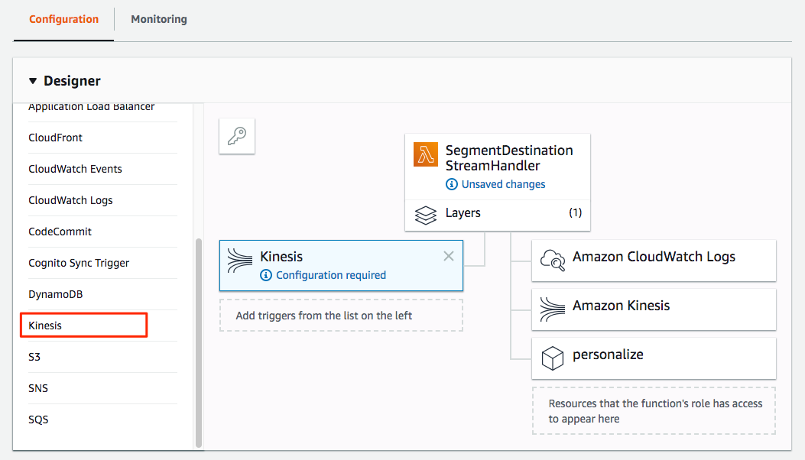

Scroll down the page to the "Configure triggers" panel. Select the Kinesis stream created earlier, set a "Batch size" of 2 (since we're testing with a small number of manually generated events), and set the "Starting position" to "Trim Horizon". Click the "Add" button to add the trigger.

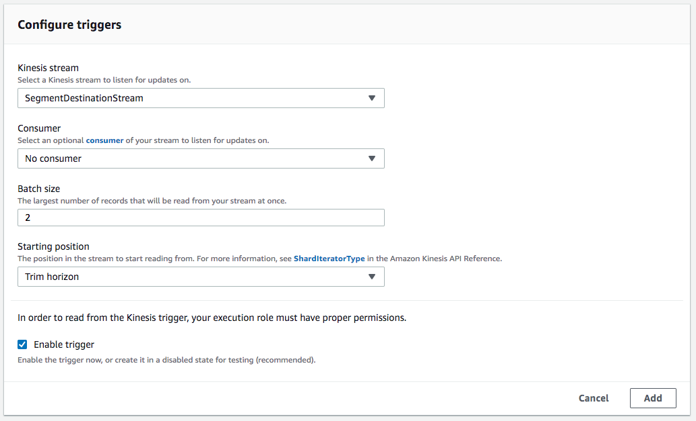

Scroll to the top of the page and click the "Save" button to save all of our changes.

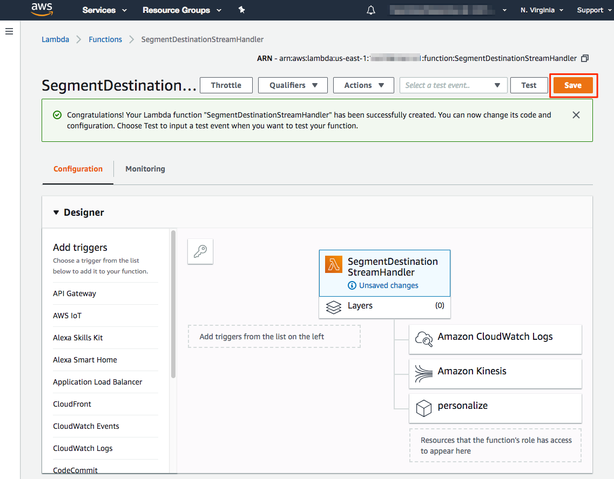

After your Lambda function has been saved and has completed its first poll of the Kinesis stream, you should start to see invocation, duration, availability statistics appear on the Lambda Monitoring tab.

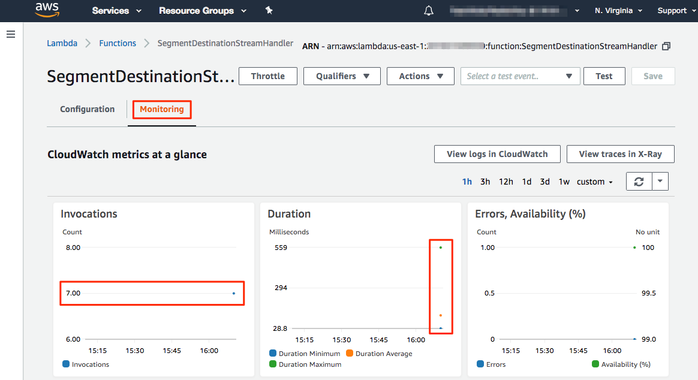

In addition, you can inspect the CloudWatch Logs for our function to see the logging output including any errors that may have occurred.

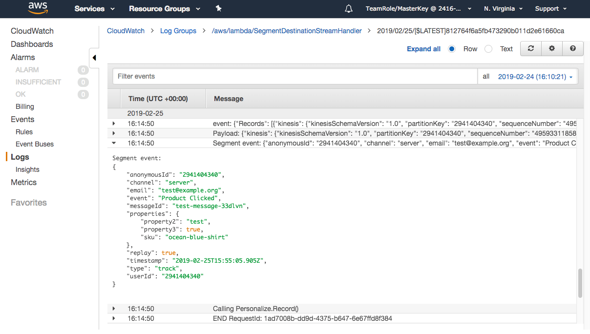

In the final [exercise](../exercise4) we will bring everything together and learn how to integrate recommendations from Personalize in your application as well as how to use Segment to activate recommendations in other integrations in your Segment account.