# Exercise 3 - Getting Recommendations from Personalize

## Overview

After you create a campaign using Amazon Personalize, you are able to get two different types of recommendations, dependent on what recipe type was used to train the model. For user-personalization and related-items recipes, the GetRecommendations API returns a list of recommended items. For example, products or content can be recommended for users signed in to your website.

For search-personalization recipes, the PersonalizeRanking API re-ranks a list of recommended items based on a specified query.

### What You'll Be Building

In this workshop we have been focused on building a user-personalization solution, so far trained on historical event data from Segment. In this exercise we will demonstrate how you can integrate recommendations from Personalize into your applications using a REST API. We will build an API Gateway endpoint that calls a Lambda function to fetch recommendations from Personalize. This example will show how to build a basic API endpoint to call Personalize directly from your applications for use cases where you will want to directly integrate recommendations.

### Exercise Preparation

If you haven't already cloned this repository to your local machine, do so now.

```bash
git clone https://github.com/james-jory/segment-personalize-workshop.git
```

## Part 1 - Create API Endpoint & Lambda Function

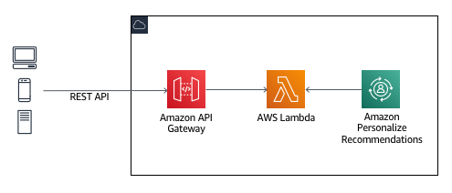

First we will create a Lambda function that will be called by an API Gateway endpoint. In the AWS console for the account you've been assigned for the workshop, browse to the Lambda service page. Click the "Create function" button to create a new function.

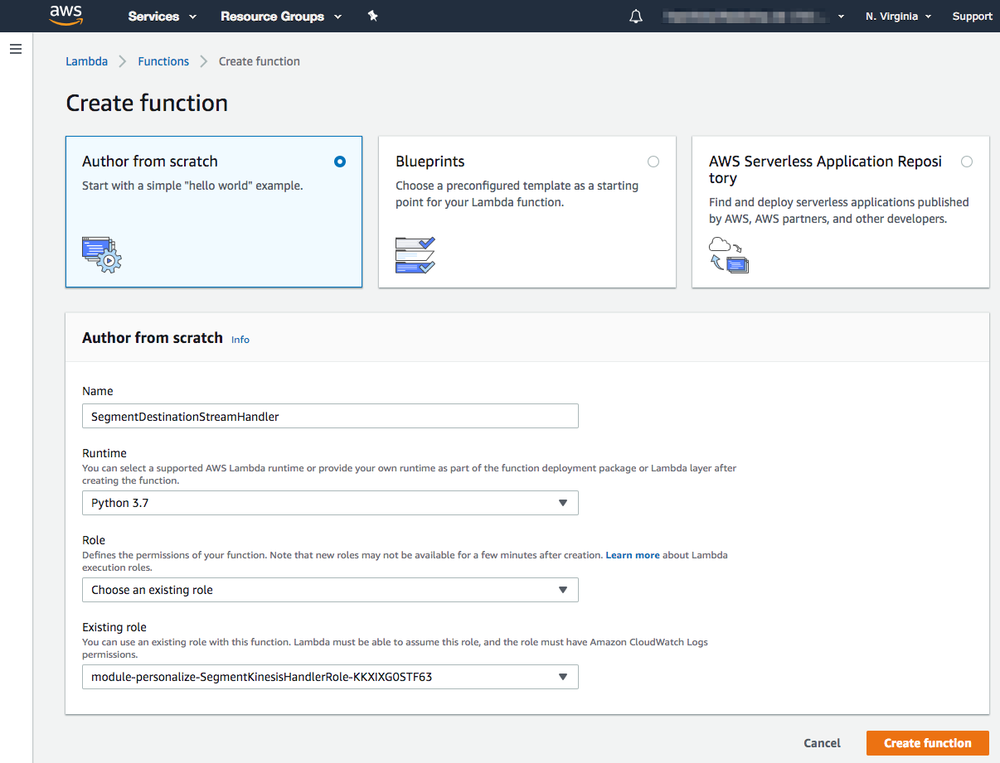

Enter a name for your function and specify Python 3.7 as the runtime. Expand the "Permissions" panel and select an existing IAM role, that has already been created for you, with a name like `module-personalize-SegmentPersonalizeLambdaRole-...`). Click "Create function".

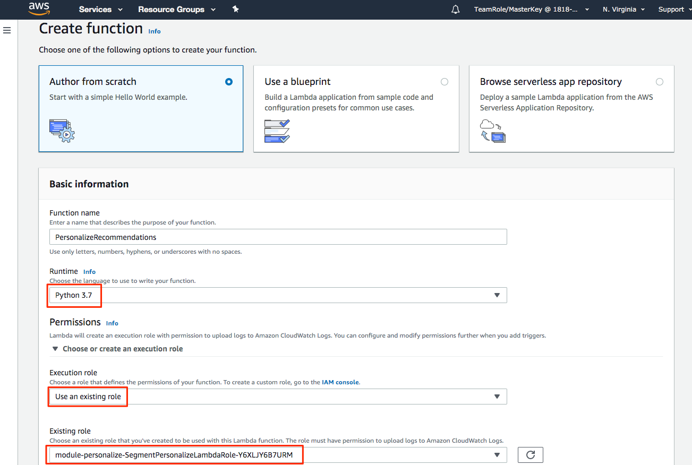

Scroll down to the "Function code" panel. The source code for the function has already been written and is provided in this repository at [recommendations/lambda_function.py](recommendations/lambda_function.py). Open this file in a new browser tab/window, copy it to your clipboard, and paste it into the source code editor for our Lambda function as shown below. Click the "Save" button at the top of the page when you're done.

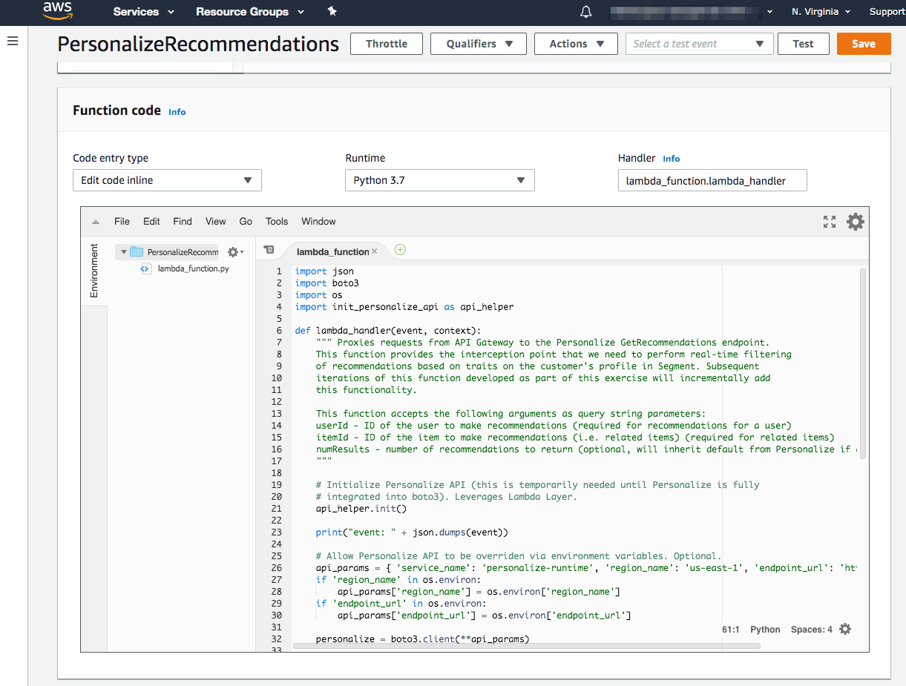

### Wire up Personalize API using Lambda Layer (Preview only)

You will notice in the function source the following `import` and function call.

```python
import of import init_personalize_api as api_helper
...
api_helper.init()
```

This `import` and function call utilize some boilerplate code, packaged as a [Lambda Layer](https://docs.aws.amazon.com/lambda/latest/dg/configuration-layers.html), needed to configure the Personalize API with the AWS Python SDK. ***This is only necessary while Personalize is in Preview. Once Personalize is GA and the API is bundled with the Python SDK, as well as other language SDKs, this supporting Layer will no longer be needed.*** For now, though, we need to install this Layer once so we can use it across the functions we build in this workshop.

To install our Layer, open the Lambda navigation panel and click "Layers".

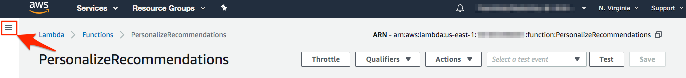


From the Lambda Layers view, click the "Create layer" button.


Create the layer by specifying a name such as "PersonalizeApiInstaller", browsing to the pre-made zip in this repository at `support/layer/python_personalize_init.zip`, and selecting Python 3.7 as the compatible runtime. Click the "Create" button to upload the zip file and create the layer.


Next we need to add the layer just created to our function. Return to the Lambda function by opening the Lambda navigation panel and clicking "Functions".


Click on your function name to access the configuration page again. In the Lambda Designer, click the "Layers" panel below the function name and then the "Add layer" button in the "Referenced layers" panel at the bottom of the page.

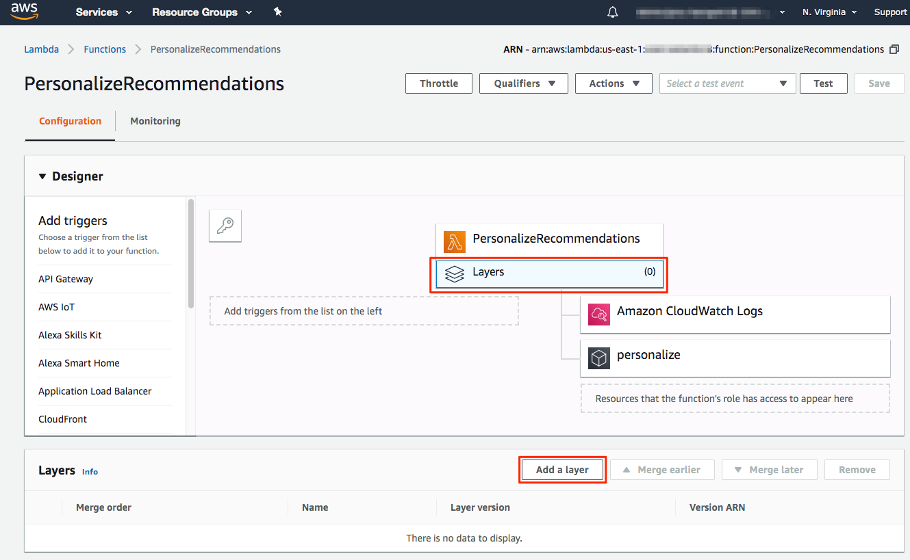

Select the layer we just added and the latest version. Click "Add" to add the layer to the function.


Next, we will connect Amazon API Gateway to our Lambda funciton. Select "API Gateway" in the "Add triggers" panel in the Designer panel.

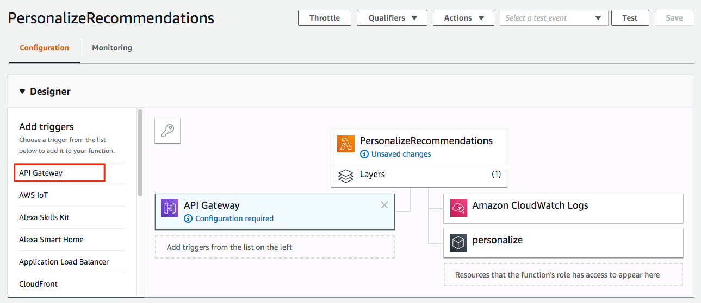

Scroll down to the "Configure triggers" panel. For the API dropdown, select "Create a new API" and set the Security as "Open". For a production deployment you would want to [control access](https://docs.aws.amazon.com/apigateway/latest/developerguide/apigateway-control-access-to-api.html) to this endpoint but that is beyond the scope of this exercise.

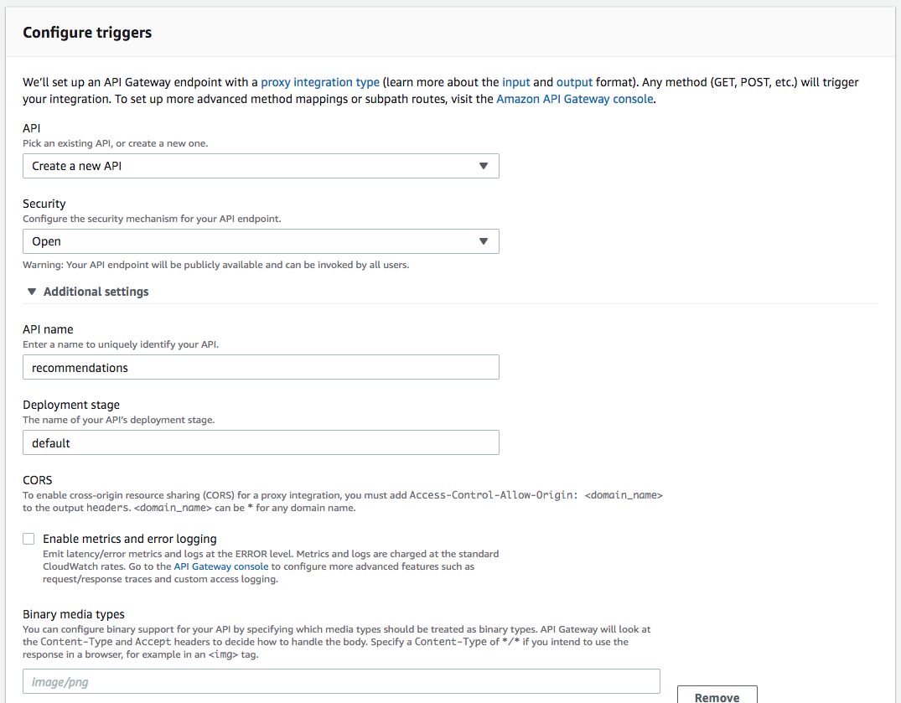

Click "Add" to add API Gateway as a trigger to our function and then click "Save" at the top of the page to save our changes.

Next, we need to add environment variables for Segment and for the function to tell it the Personalize Campaign to call for retrieving recommendations.

To obtain the Personalize Campaign ARN, browse to the Personalize service landing page in the AWS console. Select the Dataset Group you created earlier and then Campaigns in the left navigation. Click on the "segment-workshop-campaign" campaign you created earlier and copy the "Campaign arn" to your clipboard.

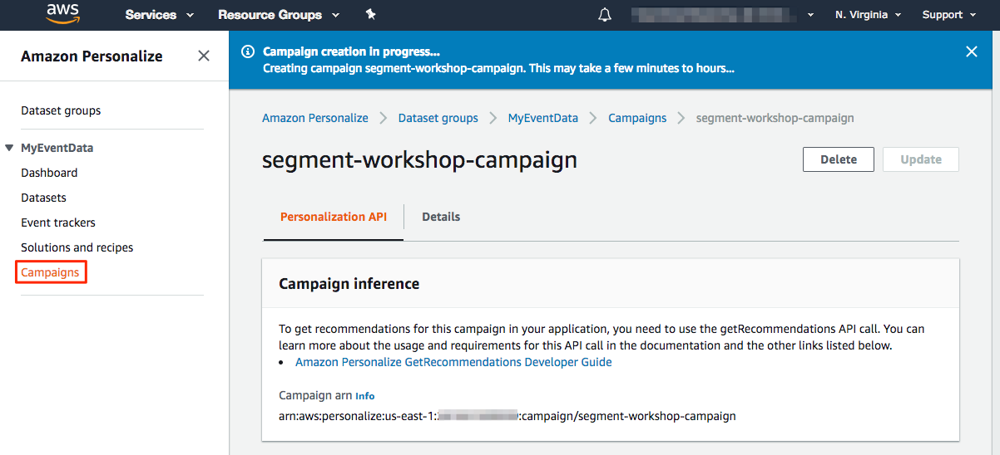

Return to our Lambda function and scroll down to the "Environment variables" panel. Add an environment variable with the key `personalize_campaign_arn` and value of the Campaign ARN in your clipboard. Click the "Save" button at the top of the page to save your changes.

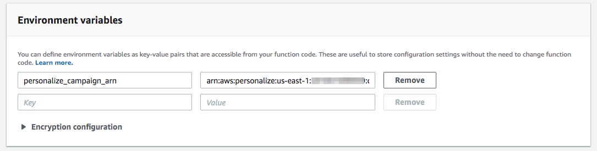

Now let's browse to the API Gateway service page in the AWS console to test our endpoint. Under "APIs" you should see the recommendations API created when we setup our Lambda trigger. Click on the API name.


Click on the "Test" link to build a test request.


Select "GET" as the Method and enter a Query String of `userId=2941404340`. This is one of the users in our test dataset. Scroll to the bottom of the page and click the "Test" button.

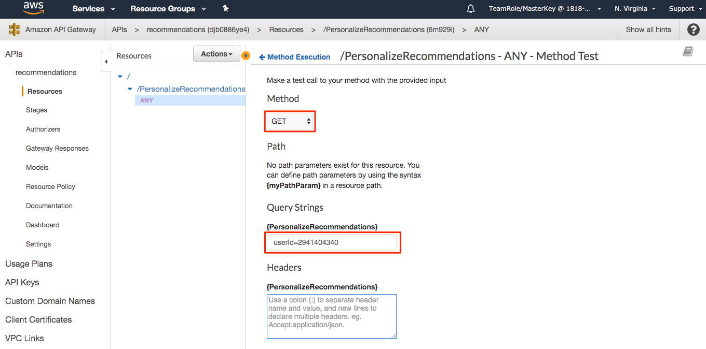

This will send a request through API Gateway which will call our Lambda function. The function will query Personalize for recommendations and return the results to API Gateway.

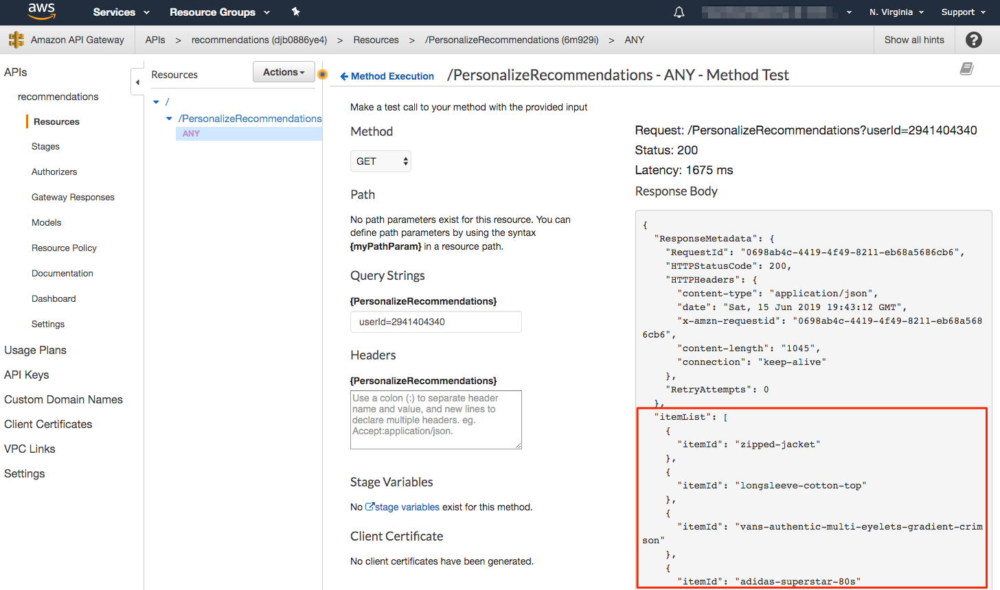

As you can see, the GetRecommendations endpoint for Personalize returns itemIds for recommended items for the specified user. Typically you would then use these itemIds to retrieve meta infromation such as item names, descriptions, and images from, say, a database or API in your application.

In the final [exercise](../exercise4) we will bring everything together and learn how to integrate recommendations from Personalize with your customer profiles in Segment. This allows you to activate recommendations across other integrations in your Segment account.