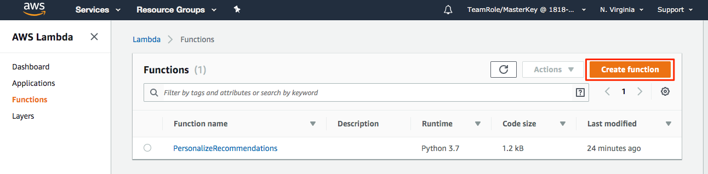
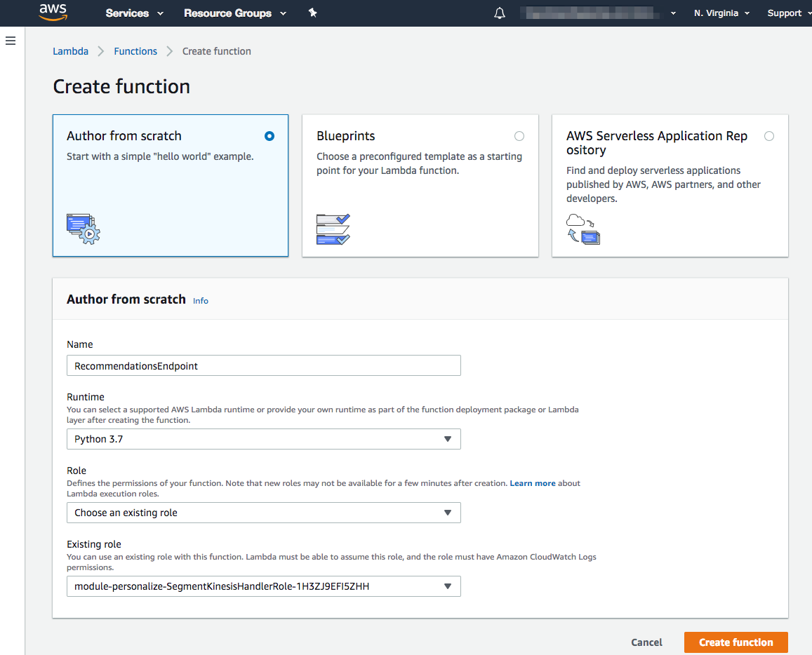
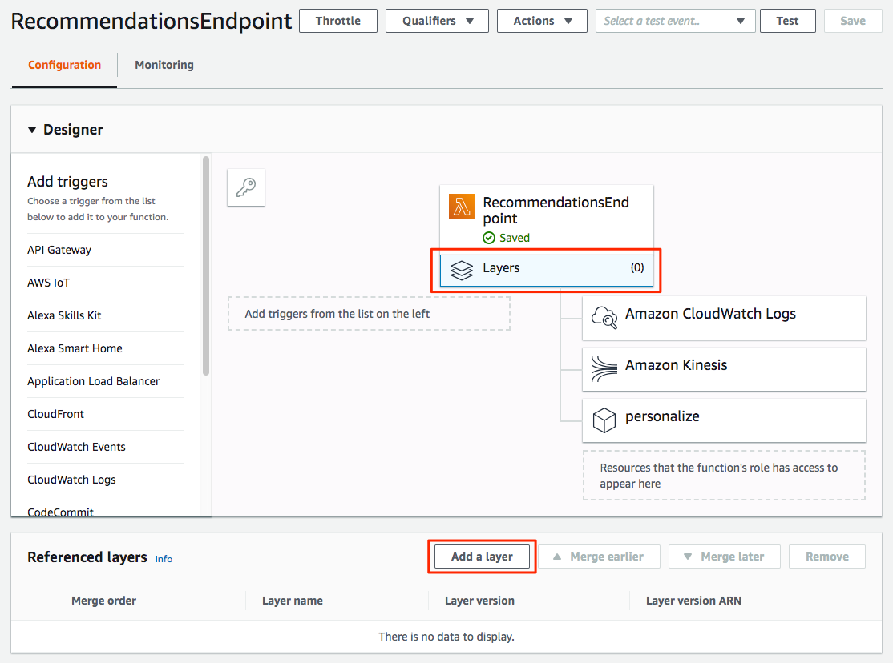
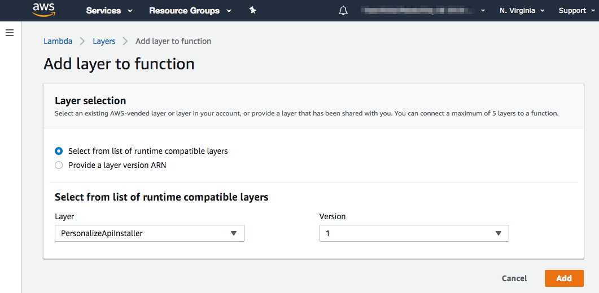
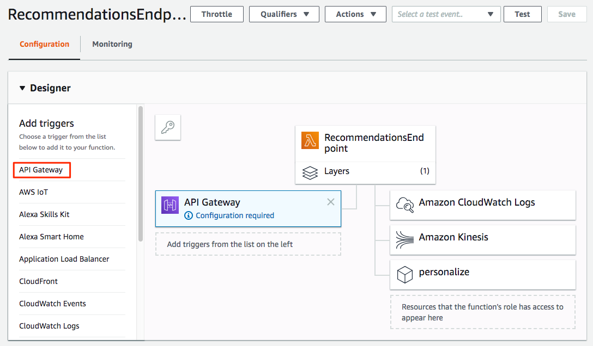
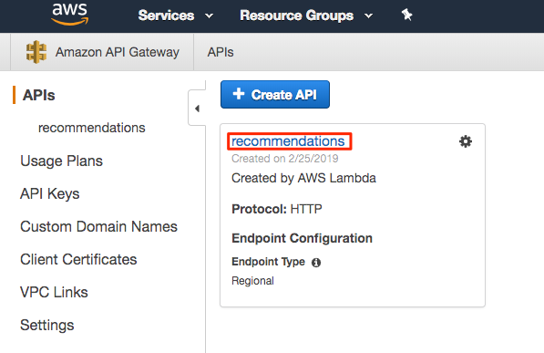
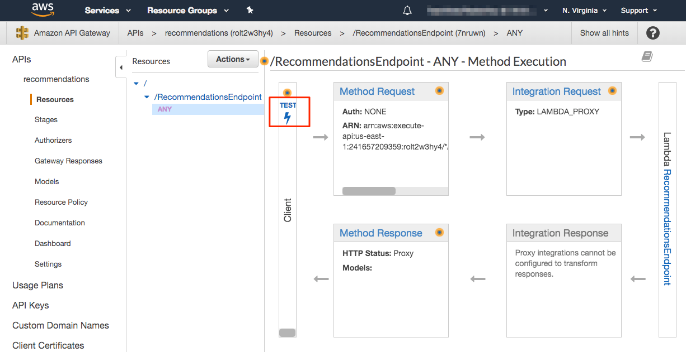
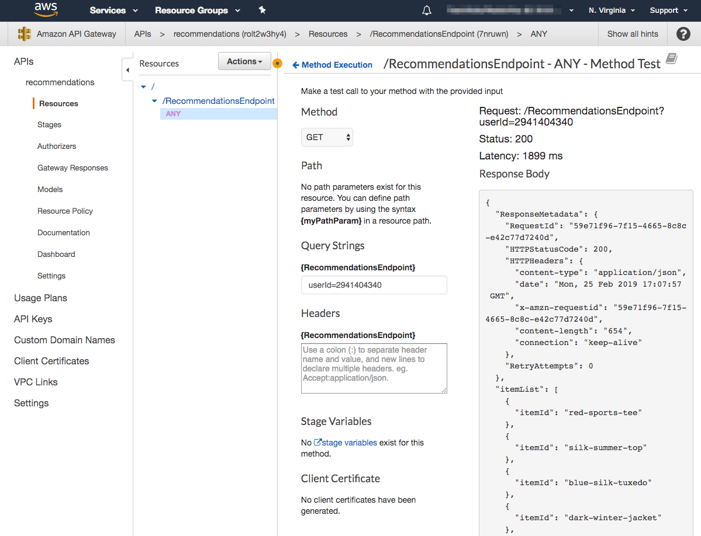

# Exercise 4 - Activating Recommendations using Segment Personas

## Overview

After you create a campaign using Amazon Personalize, you are able to get two different types of recommendations, dependent on what recipe type was used to train the model.

For user-personalization and related-items recipes, the [GetRecommendations](https://docs.aws.amazon.com/personalize/latest/dg/API_RS_GetRecommendations.html) API returns a list of recommended items. For example, products or content can be recommended for users signed in to your website.

For search-personalization recipes, the [PersonalizeRanking](https://docs.aws.amazon.com/personalize/latest/dg/API_RS_PersonalizeRanking.html) API re-ranks a list of recommended items based on a specified query.

In this workshop we have been focused on building a user-personalization solution, trained on historical and real-time clickstream event data from Segment. In this final exercise we will pull together the foundation we built in [Exercise 1](../exercise1) to transform raw event data from Segment that we used to build a Personalize Solution and Campaign in [Exercise 2](../exercise2). In [Exercise 3](../exercise3) we learned how to feed real-time event data from Segment into Personalize to improve the quality of recommendations. Now we will look at how to incorporate recommendations from Personalize into our application.

### What You'll Be Building

We will start by building an API Gateway endpoint that calls a Lambda function to fetch recommendations from Personalize. Then we will enhance this Lambda function to leverage Segment's [Personas](https://segment.com/docs/personas/) to solve one of the more challenging problems with delivering real-time recommendations. Finally, we will return to the Lambda function we built in [Exercise 3](../exercise3) and enhance it to demonstrate how we can use Personas to activate recommendations from Personalize across other integrated applications in your Segment account.

### Exercise Preparation

If you haven't already cloned this repository to your local machine, do so now.

```bash
git clone https://github.com/james-jory/segment-personalize-workshop.git
```

## Part 1 - Create API Endpoint & Lambda Function

First we will create a Lambda function that will be called by an API Gateway endpoint. In the AWS console for the account you've been assigned for the workshop, browse to the Lambda service page. Click the "Create function" button to create a new function.



Enter a name for your function, specify Python 3.7 as the runtime, and select the same IAM role we used for our Kinesis handler function (`module-personalize-SegmentKinesisHandlerRole-...`). Click "Create function".



Scroll down to the "Function code" panel. The source code for the function has already been written and is provided in this repository at [recommendations/lambda_function.py](recommendations/lambda_function.py). Open this file in a new browser tab/window, copy it to your clipboard, and paste it into the source code editor for our Lambda function as show below. Click the "Save" button at the top of the page when you're done.


Next we need to register the Lambda Layer to wire up the Personalize API with the Python SDK like we did for our previous function. Click on "Layers" below the function name in the Lambda Designer panel. Then click the "Add a layer" button.



Select the Layer and latest version and click the "Add" button.



Next, select "API Gateway" in the "Add triggers" panel in the Designer panel.



Scroll down to the "Configure triggers" panel. For the API dropdown, select "Create a new API" and set the Security as "Open". For a production deployment you would want to [control access](https://docs.aws.amazon.com/apigateway/latest/developerguide/apigateway-control-access-to-api.html) to this endpoint but that is beyond the scope of this exercise. Click "Add" to add API Gateway as a trigger to our function and then click "Save" at the top of the page.


Next, we need to add an environment variable for the function to tell it the Personalize Campaign to call for retrieving recommendations. To obtain the Personalize Campaign ARN, browse to the Personalize service landing page in the AWS console. Select the Dataset Group you created earlier and then Campaigns in the left navigation. Click on the "segment-workshop-campaign" you created earlier and copy the "Campaign arn" to your clipboard.


Return to our Lambda function and scroll down to the "Environment variables" panel. Add an environment variable with the key `personalize_campaign_arn` and value of the Campaign ARN in your clipboard. Scroll to the top of the page and click the "Save" button to save your changes.


Now let's browse to the API Gateway service page in the AWS console to test our endpoint. Under "APIs" you should see the recommendations API created when we setup our Lambda trigger. Click on the API name.



Click on the "Test" link to build a test request.



Select "GET" as the Method and enter a Query String of `userId=2941404340`. This is one of the users in our test dataset. Scroll to the bottom of the page and click the "Test" button.


This will send a request through API Gateway which will call our Lambda function. The function will query Personalize for recommendations and return the results to API Gateway.



This API framework and function provides the foundation for enhancing our function to filter recommendations based on recent purchase history in Segment.

## Part 2 - Filtering Recommendations using Customer Profile Traits

TODO: content for filtering recommendations from purchase history attached to customer profile.

## Part 3 - Activating Recommendations Across Segment Integrations

TODO: content for updating traits on customer profile with results of filtered recommendations.