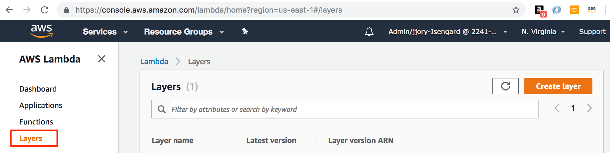
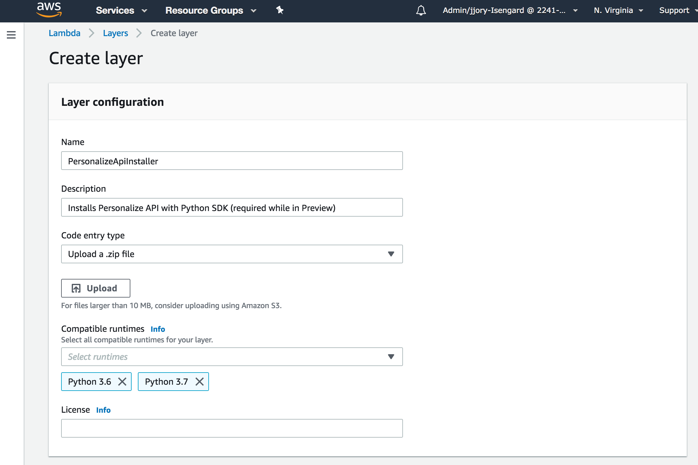
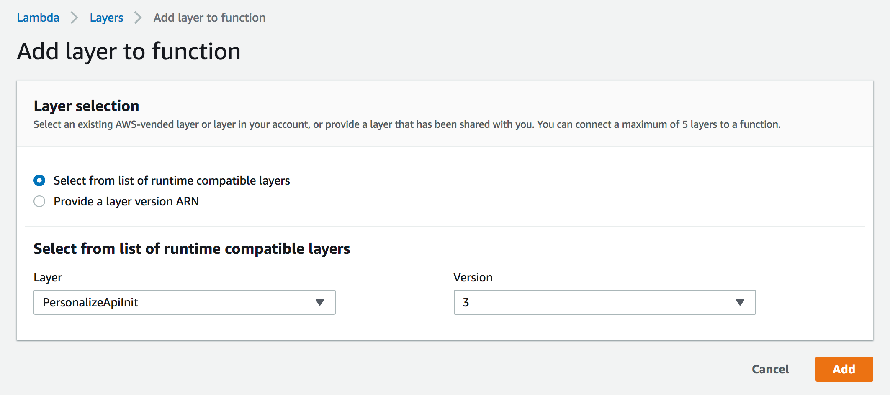

# Workshop Support Components

## Personalize API for boto3 Lambda Layer

Before you can call Personalize APIs from Python Lambda functions, the Personalize API model files have to be installed with the AWS SDK for Python. Rather than duplicate the bundling of the model files and initialization code for each function used in this workshop, a [Lambda Layer](https://docs.aws.amazon.com/lambda/latest/dg/configuration-layers.html) is used to package the files and initialization code in a reusable format. Once uploaded as a Layer, the initialization helper function can be imported and called with a single line of code.

**Note that the requirement to explicitly install the Personalize API with the Python SDK is temporary. Once the Lambda runtime for Python is updated to include the Personalize API, this layer will no longer be necessary.**

### Installing Personalize API Lambda Layer

Log in to the [AWS Console](https://console.aws.amazon.com) and select the Lambda service.

Ensure that "N. Virginia" (us-east-1) is selected in the region dropdown in the top navigation.

Click on "Layers" in the left navigation.



Click the "Create Layer" button and fill out the form entering a Name, Description (optional), and Compatible runtimes of Python 3.6 and 3.7.



Click the Upload button and browse to where you cloned this workshop repository and select the `support/layer/python_personalize_init.zip` file.

Click the Create button to upload the zip file and create the layer.

### Using Personalize API Lambda Layer

Once your layer has been created, you can use it with your Lambda function as follows.

Select a Lambda function in the AWS console. Click on the "Layers" section below the function name.


Scroll down to the "Referenced Layers" section and click the "Add a layer" button.


Select the layer created above and the latest version. Click the Add button.



The Lambda Layer you created and added to your function above has a function called `init` that will wire up the Personalize API with the AWS Python SDK. Add the following import and call to `init` at the top of your function to ensure that the Personalize API is available to you in your Python code.

```python
import init_personalize_api as api_helper

def lambda_handler(event, context):
    api_helper.init()
    ...

```